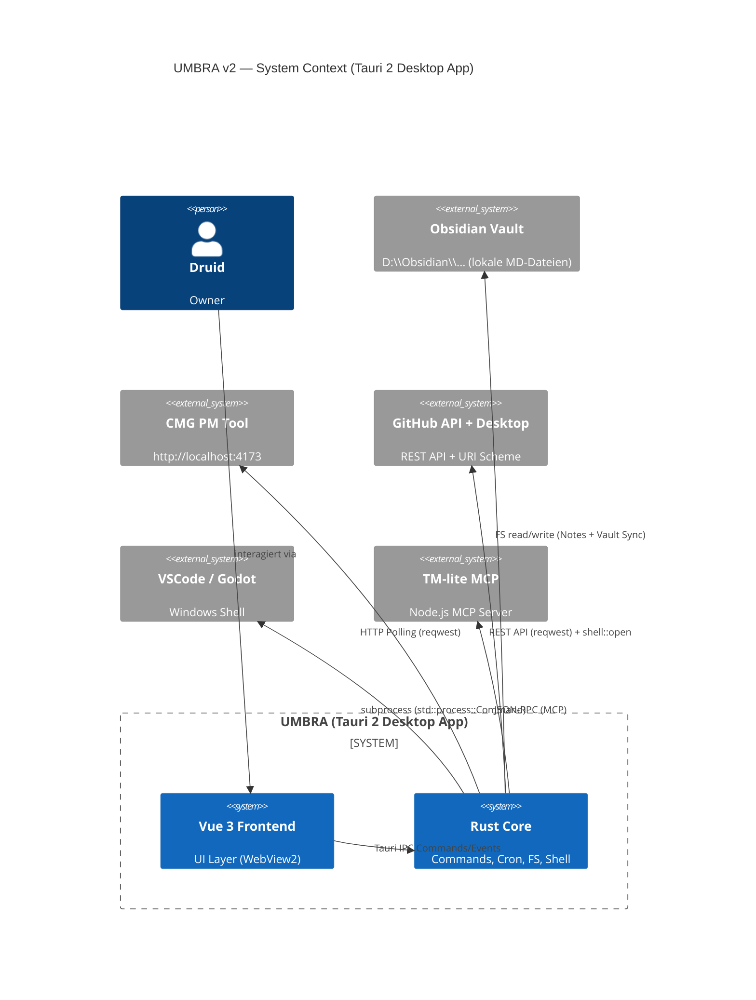

# UMBRA — Software-Architektur-Dokument v2
*Unified Management Board for Runtimes & Agents*

> "Der Schatten der alles zusammenhält."
> Version 2.0 — 2026-03-17 — Stack-Entscheidung: Tauri 2

---

## 1. Executive Summary

UMBRA ist die native Desktop-Schaltzentrale für CMG's AI-Agent-Ökosystem auf Windows 11. Es orchestriert Prism, Forge und Jim in einem einzigen, permanenten Interface: Agent-Status, Notes, Cronjobs, IDE-Launch und GitHub-Integration — alles in einer Cyberpunk-UI die sich am PRISM Hub Brand Bible orientiert.

**Tech Stack:** Tauri 2 + Rust + Vue 3 + TypeScript + TailwindCSS
**Primäre Zielplattform:** Windows 11 (native Desktop App via WebView2)

---

## 2. Tech-Stack-Entscheidung

### Gewählt: Tauri 2 + Rust + Vue 3

| Option | RAM | OS-Zugriff | Startup | Verdict |
|--------|-----|-----------|---------|---------|
| **Tauri 2 + Rust** | ~30 MB | Voll (Rust) | < 1s | **Gewählt** |
| Electron + Node | ~200 MB | Eingeschränkt | 2-5s | Abgelehnt (Bloat) |
| Lokale Web-App | n/a | Kein | n/a | Abgelehnt (kein nativer Feel) |

**Begründung:**
1. **Ökosystem-Konsistenz** — `popup-bar` nutzt bereits Tauri 2. Rust-Module sind wiederverwendbar.
2. **Windows 11 Mica-Effekt** — Tauri erlaubt transparente/transluzente App-Windows (rahmenlos, Custom Titlebar) — perfekt für Glassmorphism.
3. **Native OS-Integration** — IDE-Launch, GitHub Desktop URI, Cronjobs via `tokio` — alles in Rust, sicher und performant.
4. **Kein separater Backend-Prozess** — Der FastAPI-Ansatz aus v1 entfällt. Rust erledigt alles (File I/O, HTTP, Shell).

---

## 3. System-Kontext



---

## 4. Verzeichnisstruktur

```
umbra/
├── src-tauri/                    # Rust Backend (Tauri Core)
│   ├── src/
│   │   ├── main.rs               # Entry Point, Tauri Builder, Window Setup
│   │   ├── commands/             # Tauri #[tauri::command] Handler
│   │   │   ├── agents.rs         # Agent-Status lesen/setzen
│   │   │   ├── notes.rs          # Notes CRUD (Markdown-Dateien)
│   │   │   ├── cron.rs           # Cronjob-Manager
│   │   │   ├── launcher.rs       # IDE + GitHub Desktop Launcher
│   │   │   └── integrations.rs   # PM Tool, GitHub API
│   │   ├── cron/
│   │   │   └── scheduler.rs      # tokio-cron-scheduler Wrapper
│   │   └── models.rs             # Rust Structs (Agent, Note, CronJob)
│   ├── Cargo.toml
│   └── tauri.conf.json           # Window: frameless, transparent, 1400x900
├── src/                          # Vue 3 Frontend
│   ├── assets/
│   │   ├── fonts/                # Iceland-Regular.ttf, RubikIso-Regular.ttf
│   │   └── styles/
│   │       ├── base.css          # CSS Custom Properties, Dark Theme
│   │       ├── glassmorphism.css # .glass-card, .glass-panel
│   │       └── neon.css          # .neon-text, .neon-border, .glow-*
│   ├── components/
│   │   ├── ui/                   # Basis-Komponenten (NeonButton, GlassCard, Badge)
│   │   ├── layout/               # AppLayout, AppSidebar, CustomTitlebar
│   │   ├── agents/               # AgentCard, AgentStatusBadge
│   │   ├── notes/                # NoteEditor (Split-View), NoteList, NoteFilter
│   │   ├── cron/                 # CronJobList, CronJobEditor
│   │   └── launcher/             # IDELauncher, GitHubLauncher
│   ├── stores/
│   │   ├── useAgentStore.ts      # Live Agent-Status
│   │   ├── useNotesStore.ts      # Notes CRUD + Kategorien
│   │   ├── useCronStore.ts       # Cronjobs State
│   │   └── useTaskStore.ts       # PM Tool Tasks
│   ├── views/
│   │   ├── DashboardView.vue     # Übersicht: Agents + Tasks + Quick-Launch
│   │   ├── AgentsView.vue        # Agent-Status + Live-Aktivität
│   │   ├── NotesView.vue         # Notes-System (Markdown-Editor)
│   │   ├── CronView.vue          # Cronjob-Manager
│   │   ├── SkillsView.vue        # Skills Browser
│   │   ├── LauncherView.vue      # IDE + GitHub Launcher
│   │   └── SettingsView.vue      # Config, Themes, Pfade
│   ├── router/index.ts
│   ├── App.vue
│   └── main.ts
├── package.json
├── tailwind.config.ts
└── vite.config.ts
```

---

## 5. Frontend-Architektur (Vue 3)

### Routing

| Route | View | Beschreibung |
|-------|------|-------------|
| `/` | DashboardView | Hauptübersicht |
| `/agents` | AgentsView | Live Agent-Status |
| `/notes` | NotesView | Markdown Notes |
| `/cron` | CronView | Cronjob-Manager |
| `/skills` | SkillsView | Skill-Library |
| `/launcher` | LauncherView | IDE + GitHub Launch |
| `/settings` | SettingsView | Konfiguration |

### Pinia Stores

```typescript
// useAgentStore.ts
interface AgentStore {
  agents: Agent[]
  fetchAgents(): Promise<void>           // invoke('get_agents')
  updateAgentStatus(id, status): void   // invoke('set_agent_status', ...)
}

// useNotesStore.ts
interface NotesStore {
  notes: Note[]
  activeNote: Note | null
  filter: NoteCategory | 'all'
  loadNotes(): Promise<void>            // invoke('list_notes')
  saveNote(note): Promise<void>         // invoke('save_note', ...)
  deleteNote(id): Promise<void>         // invoke('delete_note', ...)
}

// useCronStore.ts
interface CronStore {
  jobs: CronJob[]
  loadJobs(): Promise<void>             // invoke('list_cron_jobs')
  createJob(job): Promise<void>         // invoke('create_cron_job', ...)
  toggleJob(id): Promise<void>          // invoke('toggle_cron_job', ...)
}
```

### Tauri Event Listener

```typescript
// Live-Updates vom Rust-Core empfangen
import { listen } from '@tauri-apps/api/event'

// In useAgentStore
listen('agent-status-changed', (event) => {
  const { agentId, status } = event.payload
  updateAgentInStore(agentId, status)
})

listen('cron-job-triggered', (event) => {
  addCronLog(event.payload)
})
```

---

## 6. Backend-Architektur (Rust / Tauri Core)

### Tauri Commands (IPC)

```rust
// commands/agents.rs
#[tauri::command]
async fn get_agents(state: State<'_, AppState>) -> Result<Vec<Agent>, String> { ... }

#[tauri::command]
async fn set_agent_status(id: String, status: AgentStatus, ...) -> Result<(), String> { ... }

// commands/notes.rs
#[tauri::command]
async fn list_notes(category: Option<String>) -> Result<Vec<Note>, String> { ... }

#[tauri::command]
async fn save_note(note: NoteInput) -> Result<Note, String> { ... }  // schreibt in Obsidian Vault

// commands/cron.rs
#[tauri::command]
async fn list_cron_jobs() -> Result<Vec<CronJob>, String> { ... }

#[tauri::command]
async fn create_cron_job(job: CronJobInput) -> Result<CronJob, String> { ... }

// commands/launcher.rs
#[tauri::command]
async fn launch_ide(ide: String, path: String) -> Result<(), String> { ... }  // std::process::Command

#[tauri::command]
async fn open_github_repo(repo_url: String, target: OpenTarget) -> Result<(), String> { ... }
// target: Browser | GitHubDesktop | Clone
```

### Cronjob-System (tokio-cron-scheduler)

```rust
// cron/scheduler.rs
use tokio_cron_scheduler::{Job, JobScheduler};

pub async fn start_scheduler(app_handle: AppHandle) {
    let sched = JobScheduler::new().await.unwrap();

    // Beispiel: PM Tool Polling alle 30s
    sched.add(Job::new_async("*/30 * * * * *", |_, _| Box::pin(async {
        poll_pm_tool().await;
        app_handle.emit_all("tasks-updated", payload).unwrap();
    })).unwrap()).await.unwrap();

    sched.start().await.unwrap();
}
```

### Cargo.toml Dependencies

```toml
[dependencies]
tauri = { version = "2", features = ["shell-open"] }
tokio = { version = "1", features = ["full"] }
tokio-cron-scheduler = "0.13"
reqwest = { version = "0.12", features = ["json"] }
serde = { version = "1", features = ["derive"] }
serde_json = "1"
```

---

## 7. Datenmodelle

```typescript
// interfaces/Agent.ts
export interface Agent {
  id: 'prism' | 'forge' | 'jim'
  name: string
  role: string
  status: 'IDLE' | 'WORKING' | 'OFFLINE' | 'ERROR'
  activeTaskId?: string
  lastSeen: string       // ISO timestamp
  allowedTools: string[]
  skills: string[]
}

// interfaces/Note.ts
export type NoteCategory = 'prompt' | 'cli-command' | 'agent-file' | 'skill' | 'misc'

export interface Note {
  id: string             // filename without .md
  title: string
  content: string        // Markdown
  category: NoteCategory
  tags: string[]
  createdAt: string
  updatedAt: string
  filePath: string       // absoluter Pfad in Obsidian Vault
}

// interfaces/CronJob.ts
export interface CronJob {
  id: string
  name: string
  schedule: string       // cron expression (e.g. "*/30 * * * * *")
  command: string        // was ausgeführt wird
  enabled: boolean
  lastRun?: string
  nextRun?: string
  lastStatus: 'ok' | 'error' | 'pending'
}

// interfaces/Skill.ts
export interface Skill {
  id: string
  name: string
  description: string
  trigger: string
  category: 'code' | 'review' | 'plan' | 'ship' | 'qa' | 'custom'
  agent: string
}
```

---

## 8. Notes-System (Markdown + Obsidian Sync)

### Speicherort
Alle Notes werden direkt in die Obsidian Vault geschrieben:
```
D:\Obsidian\2nd-brain\2nd-brain\UMBRA_Notes\
├── prompts\
│   └── 2026-03-17_guter-claude-prompt.md
├── cli-commands\
│   └── useful-git-commands.md
├── agent-files\
│   └── forge-agents.md
└── skills\
    └── review-skill-config.md
```

### Kategorien
| Kategorie | Beschreibung | Icon |
|-----------|-------------|------|
| `prompt` | Gute Claude-Prompts | ✦ |
| `cli-command` | Nützliche CLI-Befehle | > |
| `agent-file` | agents.md, CLAUDE.md Snippets | @ |
| `skill` | Skill-Beschreibungen, Trigger | ⚡ |
| `misc` | Sonstiges | · |

### UI-Konzept
- **Linke Spalte:** NoteList + Filter (Kategorie-Tabs, Suche)
- **Rechte Spalte:** Split-View Editor (Markdown Input + Live-Preview side-by-side)
- **Neue Note:** Floating Action Button (Neon-Stil), Kategorie auswählen
- **Auto-Save:** Debounced (500ms nach letztem Tastendruck)

---

## 9. UI/UX Design-Spec (CMG Brand)

### Ästhetik: Dark Cyberpunk Terminal

```css
/* CSS Custom Properties — Dark Theme (Default) */
:root {
  /* Backgrounds */
  --bg-primary: #0a0a0f;
  --bg-surface: rgba(255, 255, 255, 0.04);
  --bg-surface-hover: rgba(255, 255, 255, 0.08);

  /* Neon Accents */
  --accent-neon: #00f5d4;       /* Cyan-Grün */
  --accent-ember: #ff7b00;      /* Orange */
  --accent-error: #ff2d55;      /* Rot */
  --accent-success: #39ff14;    /* Grün */

  /* Typography */
  --font-primary: 'Iceland', monospace;
  --font-size-base: 14px;

  /* Glassmorphism */
  --glass-bg: rgba(255, 255, 255, 0.05);
  --glass-border: rgba(255, 255, 255, 0.12);
  --glass-blur: blur(16px);

  /* Neon Glow */
  --glow-neon: 0 0 8px var(--accent-neon), 0 0 24px rgba(0, 245, 212, 0.3);
  --glow-ember: 0 0 8px var(--accent-ember), 0 0 24px rgba(255, 123, 0, 0.3);
}
```

### Komponenten-Spec

**GlassCard:**
```css
.glass-card {
  background: var(--glass-bg);
  backdrop-filter: var(--glass-blur);
  border: 1px solid var(--glass-border);
  border-radius: 12px;
}
```

**AgentStatusBadge:**
- IDLE → `--accent-neon` (grün, pulsierend bei 0.3s ease)
- WORKING → `--accent-ember` (orange, schnell pulsierend 0.8s)
- OFFLINE → grau (no glow)
- ERROR → `--accent-error` (rot, blinkend)

**Sidebar:**
- Breite: 220px, Icon + Label
- Aktiver Link: Neon-Border links + Glow-Text
- UMBRA Logo: RubikIso-Regular.ttf, Ember-Farbe

**Custom Titlebar:**
- Rahmenlos (Tauri decorations: false)
- Eigene Titlebar-Leiste mit UMBRA Logo + Minimize/Close
- Draggable via `data-tauri-drag-region`

### Themes

| Theme | Accent | Beschreibung |
|-------|--------|-------------|
| **Neon** (Default) | Cyan `#00f5d4` | Cyberpunk grün/blau |
| **Ember** | Orange `#ff7b00` | Warm, dunkel |
| **Light** | Blau `#0066ff` | Hell, für Tageslicht |

---

## 10. Integrations-Architektur

### PM Tool (polling)
```rust
// alle 30s via tokio-cron-scheduler
async fn poll_pm_tool() -> Vec<Task> {
    reqwest::get("http://localhost:4173/api/tasks")
        .await?.json::<Vec<Task>>().await?
}
```

### GitHub Integration
```rust
// Browser
tauri::api::shell::open(&app.shell(), "https://github.com/AstroGolem224/MMC", None)?;

// GitHub Desktop
tauri::api::shell::open(&app.shell(), "github-windows://openRepo?url=...", None)?;

// Clone
std::process::Command::new("git")
    .args(["clone", &repo_url, &target_path]).spawn()?;
```

### IDE Launcher (Whitelist)
```rust
const ALLOWED_PATHS: &[&str] = &[
    "C:/Users/matth/OneDrive/Dokumente/GitHub",
    "D:/Obsidian",
];

fn launch_vscode(path: &str) -> Result<()> {
    assert!(ALLOWED_PATHS.iter().any(|p| path.starts_with(p)));
    Command::new("code").arg(path).spawn()?;
    Ok(())
}
```

### Obsidian Notes (direktes FS)
```rust
async fn save_note(note: NoteInput) -> Result<Note> {
    let vault_path = "D:/Obsidian/2nd-brain/2nd-brain/UMBRA_Notes";
    let file_path = format!("{}/{}/{}.md", vault_path, note.category, note.id);
    tokio::fs::write(&file_path, &note.content).await?;
    Ok(note.into())
}
```

---

## 11. Deployment & Dev-Setup

```bash
# Voraussetzungen
rustup update
npm install -g @tauri-apps/cli@next

# Init (einmalig)
npm create tauri-app@latest umbra -- --template vue-ts

# Dev-Modus
npm run tauri dev

# Windows Build
npm run tauri build   # → target/release/umbra.exe + .msi Installer
```

**Ports (Dev):** Vite Dev-Server auf Port `1420` (Tauri Standard), kein separater Backend-Port nötig.

---

## 12. MVP-Scope vs. Future Scope

### MVP (Phase 1 — jetzt)
- Tauri 2 Projekt-Setup (Workspace, tauri.conf.json, Custom Titlebar)
- Design-System (CSS Variables, Glassmorphism, Iceland-Font, Neon-Komponenten)
- Layout + Sidebar Navigation
- **Agent Overview** — 3 Agents + Live-Status (Tauri Events)
- **Notes-System** — Markdown Editor + Obsidian Vault Sync
- **IDE + GitHub Launcher** — VSCode, Godot, Browser, GitHub Desktop
- **PM Tool Integration** — lesend, polling via tokio-cron

### Phase 2
- **Cronjob-Manager UI** — tokio-cron-scheduler + Editor
- **Skills Browser** — Skill-Library durchsuchbar
- **GitHub API** — Repo-Status, offene PRs

### Phase 3 (Future)
- **Theme-Engine** — Laufzeit-Switcher (Neon/Ember/Light)
- **TM-lite MCP Integration** — Tasks aus UMBRA erstellen
- **Plugin-System** — erweiterbare Widgets

---

*Architektur-Dokument v2 — generiert mit NotebookLM "Master Software Architect" + Forge*
