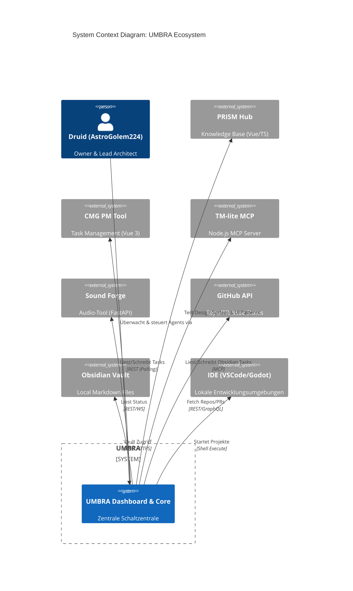
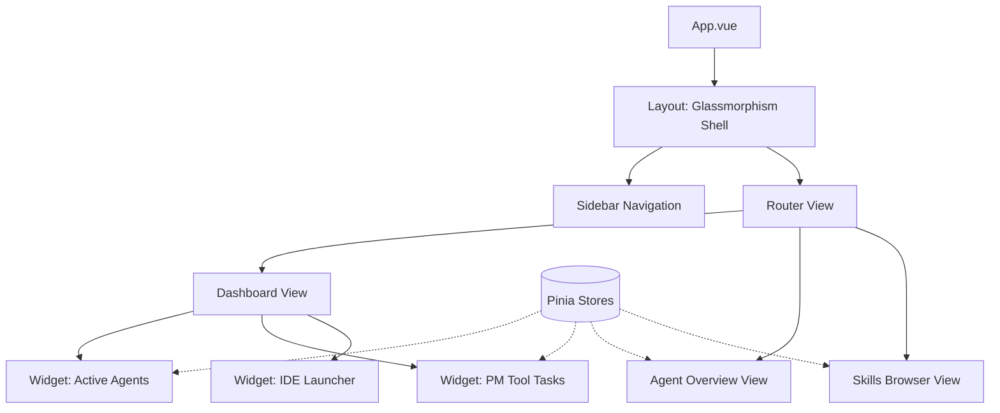

# Software-Architektur-Dokument: UMBRA (Unified Management Board for Runtimes & Agents)

## 1. Executive Summary
UMBRA ist die zentrale, unsichtbare Schaltzentrale ("Schatten-Interface") für das KI-Agenten-Ökosystem von Clay Machine Games (CMG), entwickelt unter dem Leitmotiv: *"Der Schatten, der alles zusammenhält"* [1]. Das System aggregiert und orchestriert sämtliche Runtimes, Agents (wie Prism, Forge und Jim), Skills und lokalen Tools in einem einheitlichen Dashboard [1, 2]. Es liefert dem Nutzer die vollständige operative Kontrolle über verteilte Entwicklungsprozesse, indem es Projektstände, Werkzeugzugriffe und Agenten-Status in einer hochperformanten Kommandozentrale vereint [2].

## 2. System-Kontext
UMBRA agiert als Aggregator und Orchestrator inmitten eines stark verteilten, heterogenen Tool-Ökosystems [3]. 



UMBRA muss nahtlos mit lokalen Services (z.B. PM Tool auf `localhost:4173`, Obsidian API auf `localhost:27124`) sowie externen APIs (GitHub) kommunizieren und als Brücke zwischen den Agenten und diesen Tools fungieren [4, 5].

## 3. Tech-Stack-Entscheidung
Aus den evaluierten Optionen wird **Option A (Vue-First) in Kombination mit einem FastAPI-Backend** als Architektur-Standard festgelegt [6].

**Gewählter Stack:**
*   **Frontend:** Vue 3 + Vite + TypeScript + TailwindCSS
*   **Backend:** FastAPI + Python 3.14 + WebSockets

**Begründung:**
1.  **Ökosystem-Konsistenz:** Die bestehenden Kernsysteme (PRISM Hub, CMG PM Tool) basieren bereits auf Vue 3 und TypeScript [3]. Dies minimiert den kognitiven Overhead, ermöglicht das Teilen von UI-Komponenten und garantiert eine einheitliche UX [3, 6].
2.  **Performance & Concurrency:** FastAPI (Python 3.14) ist extrem schnell und unterstützt nativ asynchrone I/O-Operationen und WebSockets [6]. Da wir strikte NFRs haben (< 500ms für Status-Updates), ist FastAPI ideal für das parallele Abrufen von Polling-Daten und das Pushen an den Client [7].
3.  **Zugänglichkeit (Remote-Fähigkeit):** Im Gegensatz zu einer reinen Desktop-App (Tauri/Electron) ermöglicht eine Web-Architektur (Client/Server) den sofortigen "Remote-Zugriff" im lokalen Netzwerk (`192.168.137.x`) von jedem Endgerät aus [6, 8]. OS-Level Befehle (wie das Starten von IDEs) werden sicher und isoliert vom FastAPI-Backend über `subprocess` auf Windows 11 ausgeführt [5, 6].

## 4. Frontend-Architektur
Das Frontend folgt dem **PRISM Hub Brand Bible**-Standard: Ein Dark-first Cyberpunk-Terminal-Style mit Glassmorphism, Neon-Buttons und der Typografie "Iceland-Regular.ttf" [9].

**Struktur & State Management:**
*   **Routing (Vue Router):** Modulare Views (`/dashboard`, `/agents`, `/skills`, `/projects`, `/settings`).
*   **State (Pinia):** Zentralisierte Stores für reaktive Daten.
    *   `useAgentStore`: Verwaltet Live-Status der Agents (Prism, Forge, Jim) [2].
    *   `useTaskStore`: Synchronisiert Tasks aus dem PM Tool und TM-lite [4, 5].
    *   `usePluginStore`: Verwaltet den Laufzeit-Status der UI-Widgets [10].



## 5. Backend-Architektur
Das FastAPI-Backend dient als Integrations-Hub und WebSocket-Server.

**Kernkomponenten:**
1.  **WebSocket Manager:** Verwaltet aktive Client-Verbindungen. Pusht asynchrone Events (z.B. "Agent Forge changed status to 'Coding'") an das Frontend, um die < 500ms Anforderung zu erfüllen [7].
2.  **Service Layer:** Kapselt die Logik für externe Systeme (`GitHubService`, `PMToolService`, `ObsidianService`). Hier implementieren wir Caching (z.B. für GitHub, um das Limit von 5000 Requests/Stunde nicht zu brechen) [4].
3.  **OS Interop Layer:** Eine stark limitierte, Whitelist-basierte `ShellExecute`-Klasse, die `code .` oder `GodotEditor.exe` sicher ausführt [5].

## 6. Datenmodelle
Die Kernentitäten werden als TypeScript-Interfaces (Frontend) und Pydantic-Modelle (Backend) synchron gehalten [11].

```typescript
// interfaces/Agent.ts
export interface Agent {
  id: string; // e.g., 'prism', 'forge', 'jim'
  name: string;
  status: 'IDLE' | 'WORKING' | 'OFFLINE' | 'ERROR';
  activeTaskId?: string;
  allowedTools: string[];
  skills: string[];
}

// interfaces/Skill.ts
export interface Skill {
  id: string;
  name: string;
  description: string;
  promptVariants: Record<string, string>;
  settings: Record<string, any>;
}

// interfaces/Project.ts
export interface Project {
  id: string;
  name: string;
  status: string; // aus PM Tool / GitHub
  assignedAgentIds: string[];
  repositoryUrl?: string;
}

// interfaces/Task.ts
export interface Task {
  id: string;
  slug: string;
  title: string;
  status: 'TODO' | 'IN_PROGRESS' | 'REVIEW' | 'DONE';
  source: 'PM_TOOL' | 'TM_LITE_MCP';
}

// interfaces/Plugin.ts
export interface Plugin {
  id: string;
  name: string;
  enabled: boolean;
  config: Record<string, any>;
}
```

## 7. Integrations-Architektur
*   **CMG PM Tool (`localhost:4173`):** Ein dedizierter Background-Worker im FastAPI-Backend pollt alle 30 Sekunden die REST API (`GET /api/tasks`) und pusht Diff-Updates via WebSocket an das Vue-Frontend [4].
*   **GitHub API:** Authentifizierung via Personal Access Token (PAT). Das Backend fetcht Commits und PRs für die Repos (MMC, popup-bar, etc.) und speichert sie im In-Memory-Cache [4].
*   **TM-lite MCP & Obsidian:** Da TM-lite ein Node.js MCP Server ist, kommuniziert FastAPI über das Model Context Protocol (via JSON-RPC) mit dem lokalen Server. Obsidian wird über die REST API auf `localhost:27124` mit API-Key direkt angesprochen [4, 5].
*   **IDE Launcher:** Über Python `subprocess.Popen` werden Windows 11 Shell-Befehle getriggert. Eine statische Whitelist validiert Projektpfade, um Sicherheitsrisiken zu eliminieren [5].

## 8. Plugin-System-Design
Das System ist "API-first" entworfen, um die Anforderungen an Laufzeit-Erweiterbarkeit zu erfüllen [10]. 

**Architektur:**
*   **Backend-Plugins:** Python-Klassen, die von einer `BasePlugin`-Klasse erben und Lifecycle-Hooks (`on_enable`, `on_disable`, `on_update`) implementieren. Sie können dynamisch eigene FastAPI-Router registrieren.
*   **Frontend-Plugins:** Vue-Komponenten, die dynamisch über Vite's `import.meta.glob` geladen werden. Jedes Plugin stellt eine `Config.vue` und ein optionales `Widget.vue` für das Dashboard bereit [10].

Die 5 initialen Plugins (PM Tool, GitHub, TM-lite, Sound Forge, Obsidian) werden intern exakt wie externe Plugins behandelt (Dogfooding), um die Architektur zu validieren [10].

## 9. Deployment und Dev-Setup
Das Setup ist für eine hochproduktive Developer Experience (DX) optimiert [6, 7].

*   **Netzwerk & Ports:** Das Frontend läuft über Vite (Dev) auf Port `5173`. Das FastAPI-Backend läuft über Uvicorn auf Port `8766`. Beide sind an `0.0.0.0` gebunden, um aus dem lokalen Netz (`192.168.137.x`) erreichbar zu sein [6].
*   **OS:** Das System wird exklusiv für Windows 11 mit einer Bash Shell optimiert. Da OS-Level-Befehle (IDE Launcher) hartcodiert auf Windows-Pfade (z.B. `D:\Obsidian\...`) und `GodotEditor.exe` mappen, ist keine plattformübergreifende Abstraktion nötig [5, 6].
*   **Security:** Es findet keine externe Exponierung statt. Sämtliche Authentifizierungsmechanismen greifen nur auf lokale oder netzwerkinterne Header-Checks zurück ("Local Auth Only") [7].

## 10. MVP-Scope vs Future Scope
Um schnellstmöglich Mehrwert für den Owner ("Druid") zu generieren, wird streng priorisiert [1, 12].

**MVP-Scope (Jetzt):**
*   **Agent Overview:** Statische Auflistung aller Agents (Prism, Forge, Jim) mit simuliertem Live-Status [2, 12].
*   **Skills Browser:** Vue-UI zur Durchsuchung der Prompt-Bibliothek [12].
*   **PM Tool Integration:** Nur lesender Zugriff (Polling der Tasks von `localhost:4173`) [4, 12].
*   **IDE Launcher:** Basis-Funktionalität, um VSCode und Godot aus dem Dashboard zu öffnen [12].
*   **Plugin Core:** Das grundlegende Interface für das Registrieren von Plugins [12].

**Future Scope (Später):**
*   **Volle Theme-Engine:** Umschalten zwischen Ember, Neon und Light Themes zur Laufzeit [8, 9].
*   **Remote Zugriff & Auth:** Sicherer Zugriff aus anderen Netzwerken (VPN/Tunneling) [8].
*   **Schreibende Integrationen:** Tasks aus UMBRA direkt im PM Tool aktualisieren (`PATCH /api/tasks/{slug}`) [4].
*   **Erweiterte Plugin-Suite:** Tiefe Integration in GitHub, Sound Forge und TM-lite MCP [10].
