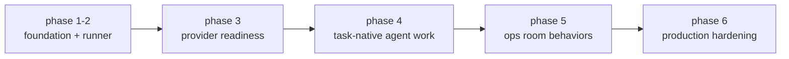

# agent workbench roadmap - 2026-03-26

## status snapshot

UMBRA hat die foundation, den ersten provider-runner und die zentrale trust-boundary fuer die `agent workbench` bereits geliefert. der aktuelle stand ist ein belastbarer workbench-mvp mit:

1. composer fuer `message + agent + workspace + mode + persona`
2. sqlite-run-history fuer runs, events und artifacts
3. provider-dispatch fuer `codex`, `claude`, `gemini` und vorbereiteten `kimi`
4. settings-flow fuer provider commands, probe, smoke, auth und bootstrap
5. per-agent UAP tokens und workspace-grant-roots

produktstatus: **phase 2 abgeschlossen, phase 3 fast abgeschlossen**

## roadmap summary

## phase 3 - provider readiness

### ziel

die provider-integration soll nicht nur technisch laufen, sondern im produkt sauber onboardbar, nachvollziehbar und sicher wirken.

### bereits enthalten

1. provider command config
2. provider probe + smoke test
3. auth-check mit per-agent token state
4. bootstrap write fuer instruction files + worker env
5. workspace grant roots
6. richer run artifacts mit exit summary, diff preview und test signals

### restarbeiten

1. `workspace picker + grant validation ux`
   - echter folder-picker fuer workspace-path und grant-root-path
   - sichtbare validation im settings-flow
2. `bootstrap overwrite/update flow`
   - bestehende repo-files bewusst aktualisieren koennen
   - delta klar kommunizieren statt hartem fail
3. `provider onboarding checklist`
   - provider readiness als sichtbare checkliste statt verteilter text-hinweise
4. `structured provider artifacts contract`
   - adapter sollen artefakte explizit liefern, nicht nur heuristisch aus output erkannt werden

### phase-3 completion bar

phase 3 gilt als abgeschlossen, wenn ein neuer provider in UMBRA eingerichtet werden kann, ohne docs lesen zu muessen oder manuell env/dateien zusammensuchen zu muessen.

## phase 4 - task-native agent work

### ziel

aus workbench-runs wird echte agent-arbeit mit klarer rueckmeldung, fortsetzung und taskbezug.

### tasks

1. `continue existing run / threaded replies`
2. `task contract + PM linking`
3. `result inspector actions for files, diffs and tests`
4. `run status contract: done, blocked, needs-input`

## phase 5 - ops room behaviors

### ziel

UMBRA bewegt sich von einer einzel-run workbench zu einer nativen multi-agent arbeitsumgebung.

### tasks

1. `channels + mention routing`
2. `jobs from messages + threaded execution`
3. `ops room ui polish and command palette integration`
4. `rules with human gate`
5. `session templates + turn-taking`

## phase 6 - production hardening

### ziel

die workbench wird alltagstauglich fuer laengere sessions, viele runs und recovery-faelle.

### tasks

1. `restart recovery + audit trail`
2. `timeline pagination + renderer performance`
3. `ops room e2e matrix`
4. `provider failure recovery and retry surface`

## task inventory

### bereits im backlog vorhanden

1. `[Epic] Ops Room fuer UMBRA integrieren (agentchattr-inspiriert, nativ)`
2. `[Feature] Ops Room UI: Channels, Timeline, Side Rail und Command Palette Entry`
3. `[Feature] Session Templates + Turn-Taking Engine fuer Multi-Agent Flows`
4. `[Feature] Rules fuer Ops Room: sichtbare Routing- und Trigger-Regeln mit Human Gate`
5. `[Testing] Ops Room Testmatrix: Rust, Vue und E2E fuer Kernfluesse`
6. `[Adapters] Claude, Gemini, Kimi und Codex fuer Ops Room vorbereiten`
7. `[Docs] Agent Setup Guide + Listener Bootstrap fuer Claude, Gemini, Kimi und Codex`
8. `[Feature] Persona Dropdown fuer den Workbench Composer`

### noch anzulegende roadmap-tasks

1. `[Phase 3] Workspace Picker + Grant Validation UX fuer Workbench`
2. `[Phase 3] Provider Bootstrap Overwrite/Refresh Flow`
3. `[Phase 3] Provider Setup Checklist + First-Run Onboarding`
4. `[Phase 3] Structured Provider Artifact Contract`
5. `[Phase 4] Continue Existing Runs + Threaded Replies`
6. `[Phase 4] Task Contract + PM Linking fuer Workbench`
7. `[Phase 4] Result Inspector Actions fuer Files, Diffs und Tests`
8. `[Phase 4] Run Status Contract: done, blocked, needs-input`
9. `[Phase 5] Channels + Mention Routing fuer Ops Room`
10. `[Phase 5] Jobs from Messages + Threaded Execution`
11. `[Phase 6] Restart Recovery + Audit Trail fuer Workbench Runs`
12. `[Phase 6] Timeline Pagination + Performance Hardening`

## completion estimate

wenn die vorhandenen backlog-karten eingerechnet werden, braucht UMBRA noch ungefaehr:

1. **4 tasks**, um phase 3 komplett abzuschliessen
2. **4 tasks**, um phase 4 zu liefern
3. **5 tasks**, um phase 5 auf produktniveau zu bringen
4. **4 tasks**, um phase 6 belastbar zu machen

gesamtbild bis zur eigentlichen idee:

1. **bestehende workbench-taskbasis steht**
2. **noch offen: ca. 12 neue tasks**
3. **mit den bereits angelegten ops-room-karten zusammen: ca. 16 restliche substanzielle workbench/ops-room tasks**

## recommendation

die naechste sinnvolle produktreihenfolge bleibt:

1. phase 3 komplett schliessen
2. phase 4 direkt danach liefern
3. phase 5 als grosser produkt-sprung
4. phase 6 erst anschliessend hartziehen
