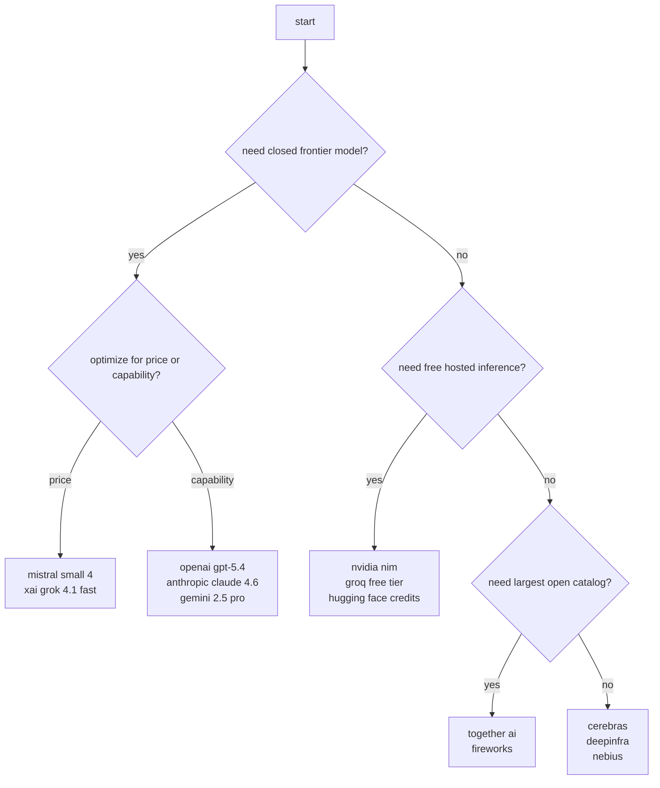

# ai provider landscape - 2026-03-22

current as checked on 2026-03-22. pricing was verified against official provider pages or official docs where possible. where a provider exposes pricing only via search snippet, region-specific page, or sales-led docs, that is called out explicitly.

## tl;dr - best options by use case

| use case | recommended provider | why |
| --- | --- | --- |
| frontier reasoning, no commitment | xai grok 4.1 fast reasoning | official api pricing is aggressive at $0.20 input / $0.50 output per 1m tokens, with 2m context and 50% batch discount. |
| long-context multimodal prod work | google gemini 2.5 flash | 1,048,576 context, solid multimodal stack, and official pricing at $0.30 input / $2.50 output per 1m tokens. |
| cheapest serious frontier-style api | mistral small 4 | official pricing is unusually low at $0.15 / $0.60 per 1m while staying in a first-party commercial stack. |
| open-weight at very low latency | groq | fast inference plus transparent pricing on llama, qwen, kimi, and more; good for realtime or agent loops. |
| open-weight catalog breadth | together ai | broadest useful hosted catalog, strong serverless pricing, and good compatibility for experimentation. |
| eu-leaning sovereign option | mistral, scaleway, nebius | better fit than defaulting to us hyperscaler APIs if data residency and regional procurement matter. |
| zero-budget prototyping | nvidia nim on build.nvidia.com | large free catalog, openai-compatible endpoints, and current build.nvidia.com usage is free for prototyping subject to rate limits. |
| cheap fast coding agents | deepseek via deepseek, together, fireworks, or deepinfra | deepseek-class models remain far cheaper than top closed models, especially through third-party hosts. |

## decision map



## methodology

1. looked up official pricing, model, and limits pages first.
2. normalized prices to `$ / 1m tokens` where vendors expose per-token billing.
3. separated hosted open-weight inference from first-party closed-model vendors.
4. flagged pricing that is sales-led, region-specific, or currently inconsistent across official docs.

## categorization

### pay-per-token

- openai
- anthropic
- google gemini
- xai
- mistral
- cohere
- ai21
- deepseek
- minimax
- z.ai / glm
- together ai
- fireworks
- groq
- cerebras
- deepinfra
- nebius
- scaleway
- cloudflare workers ai

### subscription

- mistral pro: $14.99/month
- mistral team: $24.99/user/month
- cerebras code pro: $50/month
- cerebras code max: $200/month
- hugging face pro: $9/month
- hugging face team: $20/user/month
- minimax coding plans: from CNY 29/month on current regional plan pages
- z.ai coding plan: from $10/month

### freemium

- google ai studio / gemini api free tier
- groq developer free tier
- hugging face inference credits
- fireworks starter credits
- sambanova starter credits
- nvidia nim build catalog
- mistral free plan

### fully free / open

- self-hosted vllm / sglang / llama.cpp on open-weight models
- zerogpu workloads on hugging face for supported use cases
- selected build.nvidia.com prototyping endpoints

## access and geography notes

1. openai, anthropic, google, groq, and xai all enforce country/account availability lists or tier gates; check supported-country and billing pages before rollout.
2. chinese and china-linked vendors like deepseek, minimax, z.ai, and dashscope are often price leaders, but procurement, payment rails, compliance review, and data-handling posture may be the real blocker.
3. eu buyers should benchmark mistral, scaleway, nebius, and aleph alpha-style sovereign routes separately instead of treating them as minor variants of us hosts.
4. nvidia nim on build.nvidia.com is globally handy for prototyping, but free-endpoint availability and throughput are not a contractual production guarantee.

## free-tier limits worth knowing

1. google gemini free tier is real, but not infinite. official rate-limit docs list examples such as gemini 2.5 flash-lite at 15 rpm, 250k tpm, and 1,000 rpd on free tier.
2. groq free plan is usable but model-specific. official docs list examples such as llama 4 scout at 30 rpm, 30k tpm, and 500k tpd, and kimi k2 instruct at 60 rpm, 10k tpm, and 300k tpd.
3. fireworks gives $1 in starter credits, but accounts without a payment method are provisionally capped at 10 rpm until billing is configured.
4. hugging face free accounts currently get $0.10/month in routed inference credits. pro gets $2/month and pay-as-you-go, team and enterprise get $2 per seat.
5. openai does not expose a meaningful public free api tier for these frontier models. tiered usage limits start only after billing tiers.
6. nvidia nim free endpoints are rate-limited per model and per account; there is no single public global rpm table.

## tier 1 - established players

| provider | model | input $/1m tokens | output $/1m tokens | context | notes |
| --- | --- | ---: | ---: | ---: | --- |
| openai | gpt-5.4 | $2.50 | $15.00 | 1,050,000 | strongest ecosystem depth, tools, batch, realtime, and newest flagship behavior. prompts above 272k on 1.05m-context sessions are surcharged. regional processing on gpt-5.4 family adds 10%. |
| openai | gpt-5 mini | $0.25 | $2.00 | 400k | much more rational than calling the flagship on every request. |
| openai | gpt-5 nano | $0.05 | $0.40 | 400k | likely best fit for cheap high-throughput classification or routing. |
| anthropic | claude opus 4.6 | $15.00 | $75.00 | 200k standard, 1m beta paths | still premium-priced. best when you specifically need claude-style long-form reasoning or coding behavior. |
| anthropic | claude sonnet 4.6 | $3.00 | $15.00 | 200k standard, 1m beta paths | pragmatic default in anthropic stack. |
| anthropic | claude haiku 4.5 | $1.00 | $5.00 | 200k | the only anthropic tier that feels price-competitive for routine tasks. |
| google | gemini 2.5 pro | $1.25 input up to 200k, $2.50 above 200k | $10.00 | 1,048,576 | long context and multimodal remain its clearest advantage. |
| google | gemini 2.5 flash | $0.30 | $2.50 | 1,048,576 | one of the strongest price/perf SKUs in tier 1. cached input is $0.075. |
| google | gemini 2.5 flash-lite | $0.10 | $0.40 | 1,048,576 | absurdly cheap for structured extraction and bulk tasks. |
| mistral | mistral large 3 | $0.50 | $1.50 | vendor page | materially cheaper than top-tier closed rivals. |
| mistral | mistral medium 3 | $0.40 | $2.00 | vendor page | better priced than the big us labs if you do not need their exact flagship behavior. |
| mistral | mistral small 4 | $0.15 | $0.60 | vendor page | standout budget commercial api. |
| mistral | devstral 2 | $0.40 | $2.00 | vendor page | coding-focused line; interesting if you want first-party dev tooling and eu posture. |
| cohere | command a | about $2.50 | about $10.00 | 256k | enterprise-friendly, but pricing is no longer the main reason to pick it. |
| cohere | command r7b | about $0.0375 | about $0.15 | 128k | still a useful low-cost option for retrieval-heavy enterprise work. |

## tier 1 take

1. google currently wins the boringly rational buy for long-context multimodal workloads.
2. mistral is the best-value incumbent if you want a conventional commercial api without frontier-tax pricing.
3. openai and anthropic still dominate on ecosystem pull, but both are easy to overspend on if you do not actively route traffic to smaller SKUs.

## tier 2 - newcomers & challengers

| provider | model | input $/1m tokens | output $/1m tokens | context | what makes them interesting |
| --- | --- | ---: | ---: | ---: | --- |
| xai | grok-4.20-0309-reasoning | $2.00, cached input $0.20 | $6.00 | 2,000,000 | more aggressive than the top incumbents on both pricing and context. batch api is 50% off. |
| xai | grok-4.1-fast-reasoning | $0.20, cached input $0.05 | $0.50 | 2,000,000 | one of the most important pricing moves in the market. this is why xai matters. |
| xai | grok-4.1-fast-non-reasoning | $0.20, cached input $0.05 | $0.50 | 2,000,000 | same token price, useful for high-throughput agent loops. |
| deepseek | deepseek-chat / v3.2-exp | $0.28 | $0.42 | 128k | still the benchmark for "why am i paying frontier prices for routine work?". openai-compatible. |
| deepseek | deepseek-reasoner | docs currently inconsistent | docs currently inconsistent | 128k | deepseek's official docs currently mix old reasoner pricing and new v3.2-exp mapping; verify before large commits. |
| minimax | m2.5 | about $0.15 | about $1.20 | 204.8k | asia-based challenger with serious price/perf and low-cost coding plans. |
| minimax | m2.5-lightning | about $0.30 | about $2.40 | 204.8k | faster premium tier; official snippets say standard m2.5 is half the price. |
| z.ai | glm-4.7 | about CNY 4 in | about CNY 16 out | vendor page | underrated chinese provider with competitive pricing and free flash variants. |
| z.ai | glm-5 | about CNY 7.5 in | about CNY 24 out | vendor page | credible alternative when you want something different from qwen/deepseek/llama saturation. |
| alibaba dashscope | qwen3-max | about CNY 2.5 in per 1m | about CNY 20 out per 1m | vendor page | regional winner if you are already inside alibaba cloud or need qwen-native access. |
| alibaba dashscope | qwen3-coder-plus | token pricing by sku | token pricing by sku | up to 1,000,000 | million-token context is the hook here. |
| ai21 | jamba mini | about $0.20 | about $0.40 | 256k | rarely top-of-mind, but very usable for cost-sensitive production work. |
| ai21 | jamba large | about $2.00 | about $8.00 | 256k | less compelling than mini on pure price, but still cheaper than several closed rivals. |

## tier 2 take

1. xai is no longer a curiosity. `grok-4.1-fast-*` is a real pricing event.
2. deepseek remains the single biggest deflationary force in text inference.
3. the china-based challengers are not niche anymore. they are where a lot of pricing pressure is coming from.

## tier 3 - free / open inference

| provider | models | free tier limits | paid upgrade | api compat | notes |
| --- | --- | --- | --- | --- | --- |
| nvidia nim / build.nvidia.com | 221 catalog models, 94 marked free endpoint at check time | free prototyping, model-specific rate limits | paid deployment and enterprise routes outside build catalog | openai-compatible | old credit guidance is outdated; current build catalog is free-to-use for prototyping subject to limits. |
| groq | llama, qwen, kimi, deepseek-class, speech models | developer free tier with model-specific rpm/tpm caps | usage billing by model | openai-compatible patterns available | probably the best zero-to-low-cost option if latency matters. |
| hugging face inference providers | mix of routed third-party models | monthly credits, higher on pro/team | pay-as-you-go after credits, or dedicated endpoints from $0.03/hr cpu | varies by provider, broadly standard http/json | strongest ecosystem for trying many model families without committing to one vendor. |
| fireworks ai | broad open-weight catalog | $1 starter credits | pay-per-token | openai-compatible | good catalog and decent routing economics; useful middle ground between together and groq. |
| together ai | huge serverless catalog | no broad free trial on current billing page; minimum $5 credits | pay-per-token or dedicated hourly | openai-compatible | still excellent, but the "free tier" reputation is outdated. |
| cerebras | qwen, glm, gpt-oss, llama and more | free tier available with lower limits | developer from $10, plus code subscriptions | openai-compatible sdk patterns | ridiculous tokens/sec is the differentiator, not catalog breadth. |
| sambanova cloud | deepseek family and others | $5 signup credits | pay-per-token | openai-compatible | underrated if you want deepseek variants with simple hosted access. |
| deepinfra | llama, qwen, deepseek, kimi, many open models | limited free/intro paths vary | pay-per-token | openai-compatible | cheap commodity host with surprisingly competitive pricing. |
| nebius ai studio | llama, deepseek, kimi, qwen | credits/promos vary by account | pay-per-token | openai-compatible | europe-adjacent host with aggressive prices. |
| scaleway inference | qwen, llama, mistral, others | limited free promo posture | pay-per-token | standard api posture | one of the few european names worth watching closely. |
| cloudflare workers ai | curated edge-hosted catalog | small free/dev paths via workers plans | pay-per-token or per-step | cloudflare-native; gateway adapters exist | strong if your app is already on cloudflare and you care about edge placement. |

## nvidia nim - free models overview

### what is actually free

1. as of 2026-03-22, `build.nvidia.com/models` showed `221` models in the catalog and `94` tagged as `free endpoint`.
2. current nvidia guidance is that build.nvidia.com is not operating on the old public credit bucket anymore for normal prototyping use.
3. older forum posts about `1,000 starter credits + 4,000 extra credits` still exist, but they describe an earlier program and should not be treated as the current default.

### how to access it

1. create an nvidia developer account.
2. generate an api key from build.nvidia.com.
3. call the openai-compatible base url:

```text
https://integrate.api.nvidia.com/v1
```

4. common chat endpoint:

```text
https://integrate.api.nvidia.com/v1/chat/completions
```

### rate limits and limitations

1. limits are model-specific and account-specific; nvidia does not expose one simple global rpm table for the entire catalog.
2. free endpoints are meant for prototyping, not guaranteed production throughput.
3. availability can change by model family as nvidia rotates what is free in the catalog.

### notable free endpoint families seen in the catalog

- deepseek: `deepseek-v3.2`, `deepseek-v3.1`, `deepseek-v3.1-terminus`
- kimi: `kimi-k2-thinking`, `kimi-k2-instruct`, `kimi-k2-instruct-0905`
- mistral: `mistral-large-3-675b-instruct-2512`, `mistral-medium-3-instruct`, `mistral-small-3.1-24b-instruct-2503`, `magistral-small-2506`, `devstral-2-123b-instruct-2512`
- qwen: `qwen3.5-122b-a10b`, `qwen3-coder-480b-a35b-instruct`, `qwen2.5-coder-7b-instruct`, `qwen2-7b-instruct`, `qwq-32b`
- llama: `llama-4-maverick-17b-128e-instruct`, `llama-4-scout-17b-16e-instruct`, safety and retriever variants
- gemma / phi / granite / jamba / chatglm / falcon / solar / rakuten / sea-lion and others
- multimodal and special models: `phi-4-multimodal-instruct`, `stable-diffusion-3-medium`, `nv-embed-v1`, `nv-embedcode-7b-v1`, safety, rerank, ocr, and vision models

### opinion

1. nim is excellent for prototype breadth and "try 10 models before lunch".
2. nim is not the cleanest production default because free access, limits, and catalog mix can shift.
3. if you need stable cheap production hosting of open models, together, fireworks, deepinfra, groq, or nebius are usually less weird.

## hidden gems

| provider | why it matters | concrete pricing / access signal |
| --- | --- | --- |
| nebius ai studio | one of the more credible europe-based-ish challengers for cheap open-weight inference | official pricing snippets show llama 4 maverick around $0.20 / $0.60 and deepseek v3.1 around $0.30 / $0.50 per 1m. |
| scaleway inference | real eu option instead of pretending sovereignty concerns do not exist | official snippets show llama 4 scout around $0.14 / $0.42 and qwen3 thinking around $0.35 / $1.40. |
| sambanova cloud | often ignored, but its deepseek hosting is straightforward and signup credits are useful | official pricing page showed $5 signup credits and deepseek v3.1 at $3 / $4.5. |
| cloudflare workers ai | edge placement plus cloudflare integration can dominate total system latency | official docs expose per-model pricing, for example llama 3.3 70b fast around $0.29 / $0.88 per 1m. |
| ai21 | strangely under-discussed given how usable jamba mini pricing is | official snippets show jamba mini around $0.20 / $0.40 and free credits for new accounts. |
| z.ai | free flash variants and competitive paid glm pricing make it worth actual benchmarking | official pages/snippets show glm-4.5-flash and glm-4.7-flash free, with paid glm tiers above them. |
| cerebras | if throughput is the constraint, their tokens/sec numbers are not marketing fluff anymore | official pricing page lists gpt-oss 120b at $0.35 / $0.75 and free tier access. |
| deepinfra | boring in a good way: cheap, broad, openai-compatible commodity host | official snippets show deepseek v3.2 around $0.26 / $0.38 and llama 4 maverick around $0.18 / $0.60. |
| minimax | the western market still underrates it | official snippets show m2.5-lightning at $0.30 / $2.40 and standard m2.5 at half that price. |
| dashscope | if you want first-party qwen access with regional leverage, this is the route | official alibaba docs expose qwen3-max pricing in yuan and large-context coder SKUs. |

## providers with opaque or sales-led pricing

1. aleph alpha: relevant for eu sovereign procurement, but public api pricing is not cleanly exposed and enterprise engagement still feels sales-led.
2. some cohere enterprise pathways: public pricing exists for main models, but several enterprise/security details remain sales-layer territory.
3. several regional clouds expose partial pricing by model family but hide credits, quotas, or enterprise features behind account-specific views.

## recommendations by budget

### zero budget

1. nvidia nim on build.nvidia.com
2. groq free tier
3. hugging face routed inference credits

### under EUR 20/month

1. hugging face pro at $9/month if you want broad experimentation plus credits.
2. mistral pro at $14.99/month if you want a flat subscription and simple access.
3. buy the minimum credits on together, fireworks, or deepinfra and route traffic to gemma, qwen, or deepseek-class models instead of paying for flagship closed models.

### under EUR 100/month

1. gemini 2.5 flash for long-context multimodal production loads.
2. xai grok-4.1-fast-reasoning if you want frontier-ish behavior without openai/anthropic pricing pain.
3. a mixed stack: groq for low-latency calls, deepseek or qwen on together/fireworks for bulk work, and one premium closed model only for escalation paths.

### unlimited / scale

1. google gemini + vertex if you need long-context multimodal scale and enterprise plumbing.
2. openai if tool ecosystem, responses api, and broad vendor support matter more than token thrift.
3. anthropic if your org has already standardized around claude-style coding/reasoning workflows and will actually pay for it.

## opinionated conclusions

1. the market is splitting into three lanes: premium closed labs, cheap first-party challengers, and commodity open-weight hosts.
2. the most important price disruption is not another "mini" model from an incumbent. it is the combination of xai fast tiers, deepseek pricing, and cheap multi-host open-weight serving.
3. most teams still overspend because they use one vendor for every request. that is lazy architecture, not necessity.
4. if you are in europe, stop pretending provider choice is only about benchmarks. mistral, scaleway, nebius, and sales-led sovereign vendors exist for a reason.

## source links

- openai pricing: [openai.com/api/pricing](https://openai.com/api/pricing/)
- openai models: [platform.openai.com/docs/models](https://platform.openai.com/docs/models)
- anthropic pricing: [docs.anthropic.com/en/docs/about-claude/pricing](https://docs.anthropic.com/en/docs/about-claude/pricing)
- anthropic models: [docs.anthropic.com/en/docs/about-claude/models/all-models](https://docs.anthropic.com/en/docs/about-claude/models/all-models)
- google pricing: [ai.google.dev/pricing](https://ai.google.dev/pricing)
- google rate limits: [ai.google.dev/gemini-api/docs/rate-limits](https://ai.google.dev/gemini-api/docs/rate-limits)
- mistral pricing: [mistral.ai/pricing](https://mistral.ai/pricing)
- cohere pricing: [cohere.com/pricing](https://cohere.com/pricing)
- ai21 pricing: [studio.ai21.com](https://studio.ai21.com/)
- xai models: [docs.x.ai/developers/models](https://docs.x.ai/developers/models)
- xai rate limits: [docs.x.ai/developers/rate-limits](https://docs.x.ai/developers/rate-limits)
- deepseek pricing: [api-docs.deepseek.com/quick_start/pricing](https://api-docs.deepseek.com/quick_start/pricing)
- minimax pricing: [platform.minimax.io](https://platform.minimax.io/)
- z.ai pricing: [docs.z.ai](https://docs.z.ai/)
- alibaba dashscope pricing: [help.aliyun.com](https://help.aliyun.com/)
- groq pricing and models: [console.groq.com/docs/models](https://console.groq.com/docs/models)
- together pricing: [together.ai/pricing](https://www.together.ai/pricing)
- fireworks pricing: [fireworks.ai/pricing](https://fireworks.ai/pricing)
- cerebras pricing: [cerebras.ai/pricing](https://www.cerebras.ai/pricing)
- hugging face pricing: [huggingface.co/pricing](https://huggingface.co/pricing)
- nvidia build model catalog: [build.nvidia.com/models](https://build.nvidia.com/models)
- nvidia openai compatibility docs: [docs.api.nvidia.com](https://docs.api.nvidia.com/)
- sambanova pricing: [cloud.sambanova.ai/plans/pricing](https://cloud.sambanova.ai/plans/pricing)
- nebius pricing: [nebius.com/prices-ai-studio](https://nebius.com/prices-ai-studio)
- scaleway inference: [scaleway.com/en/inference](https://www.scaleway.com/en/inference/)
- cloudflare workers ai pricing: [developers.cloudflare.com/workers-ai/platform/pricing](https://developers.cloudflare.com/workers-ai/platform/pricing/)
