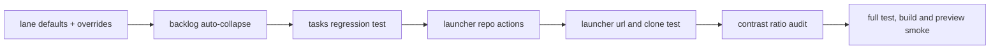

# backlog auto-collapse + contrast audit + launcher repo actions - 2026-03-22

## scope

dieser pass setzt die naechsten drei ausbauschritte um:

1. `backlog` nur dann automatisch zusammenklappen, wenn es als lane wirklich zu dicht wird
2. kontrast nicht mehr nur “sieht besser aus”, sondern mit konkreten farb-paaren und ratios dokumentieren
3. dem launcher echte repo-actions geben: `issues`, `prs`, `copy https`, `copy ssh`

## umgesetzt

### 1. backlog intelligent auto-collapsible

- [TasksView.vue](C:\Users\matth\OneDrive\Dokumente\GitHub\UMBRA\src\views\TasksView.vue)
- statt fester lane-booleans nutzt das taskboard jetzt:
  1. default-verhalten pro lane
  2. user-overrides pro lane
- `done` und `review` bleiben default-collapsed, sobald tasks darin liegen
- `backlog` klappt jetzt erst automatisch ein, wenn mindestens `6` items darin liegen
- leere lanes bleiben offen

### 2. test-absicherung

- [TasksView.test.ts](C:\Users\matth\OneDrive\Dokumente\GitHub\UMBRA\src\views\__tests__\TasksView.test.ts)
- neuer test prueft, dass eine backlog-lane mit `6` items initial collapsed ist und sich manuell wieder oeffnen laesst

### 3. launcher repo-actions

- [LauncherView.vue](C:\Users\matth\OneDrive\Dokumente\GitHub\UMBRA\src\views\LauncherView.vue)
- fuer `all repos` gibt es jetzt:
  1. `open repo`
  2. `copy link`
  3. `issues`
  4. `prs`
  5. `copy https`
  6. `copy ssh`
- fuer `pinned repos` gibt es jetzt dieselben repo-actions direkt pro card
- die urls werden aus `owner/repo` oder `fullName` gebaut und ueber den bestehenden `open_github_url`-command geoeffnet

### 4. launcher-test

- [LauncherView.test.ts](C:\Users\matth\OneDrive\Dokumente\GitHub\UMBRA\src\views\__tests__\LauncherView.test.ts)
- prueft jetzt:
  1. `issues` -> `https://github.com/matth/UMBRA/issues`
  2. `prs` -> `https://github.com/matth/UMBRA/pulls`
  3. `copy ssh` -> `git@github.com:matth/UMBRA.git`

## kontrast-audit

die ratios wurden fuer die light-theme-paare ueber einen kleinen node-check berechnet. fokus war normaler text und status-/priority-pills, also genau die stellen, die visuell schnell “zu hell” werden.

| paar | ratio | bemerkung |
| --- | ---: | --- |
| text-primary auf glass-bg | 16.21:1 | deutlich ueber aa/aaa |
| text-secondary auf glass-bg | 7.13:1 | klar ueber aa |
| accent auf glass-bg | 5.59:1 | links/accent text tragfaehig |
| online badge | 6.51:1 | sauber |
| working badge | 4.73:1 | knapp, aber ueber aa fuer normalen text |
| idle badge | 5.26:1 | sauber |
| offline badge | 6.81:1 | sauber |
| error badge | 5.33:1 | sauber |
| priority high | 4.73:1 | knapp, aber ueber aa |
| priority medium | 5.26:1 | sauber |
| priority low | 5.92:1 | sauber |

## verifikation

1. gezielter vitest fuer tasks + launcher gruen
2. `npm test` gruen, `17/17`
3. `npm run build` gruen
4. frische preview auf `http://host.docker.internal:4189`

## browser smoke

geprueft:

1. launcher zeigt im leeren state jetzt nicht nur `open repo` und `copy link`, sondern auch die neuen disabled actions `issues`, `prs`, `copy https`, `copy ssh`
2. die disabled actions sitzen visuell sauber in derselben action-row und kippen das layout nicht

einschraenkung:

1. in der preview waren weiterhin keine echten repo-/ide-targets konfiguriert
2. echte live-klicks auf repo-cards wurden deshalb ueber tests statt ueber den browser-smoke abgesichert

## flow

## kritik

1. backlog auto-collapse ist jetzt sinnvoller, aber die naechste stufe waere eine persistente user-pref pro lane statt session-state
2. der kontrast-audit ist jetzt nachvollziehbar, aber noch kein kompletter farb-audit aller hover/focus/disabled-zustaende
3. beim launcher waere der naechste echte produktivitaetssprung eine `open local repo`- oder `open terminal here`-action, falls lokale clone-pfade irgendwann konfiguriert werden
