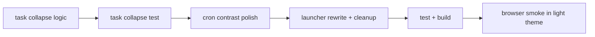

# contrast + cron/launcher + task collapse pass - 2026-03-22

## scope

dieser pass hat drei follow-ups kombiniert:

1. kontrast und light-theme-lesbarkeit in den zuletzt angefassten views weiter haerten
2. `cron` und `launcher` visuell an die ruhigere shell angleichen
3. task-cards collapsible machen, mit fokus auf der `done`-lane

## umgesetzt

### 1. collapsible task cards

- [TasksView.vue](C:\Users\matth\OneDrive\Dokumente\GitHub\UMBRA\src\views\TasksView.vue)
- task-cards haben jetzt oben rechts einen toggle-button
- collapsed state zeigt `+`, expanded state `−`
- `done`-cards starten standardmaessig collapsed
- summary und actions verschwinden im collapsed state, damit abgeschlossene lanes ruhiger werden

### 2. test-absicherung

- [TasksView.test.ts](C:\Users\matth\OneDrive\Dokumente\GitHub\UMBRA\src\views\__tests__\TasksView.test.ts)
- test deckt jetzt explizit ab, dass eine done-card initial collapsed ist und sich wieder aufklappen laesst

### 3. cron polish + contrast

- [CronView.vue](C:\Users\matth\OneDrive\Dokumente\GitHub\UMBRA\src\views\CronView.vue)
- pill-rhythmus, panel-radien und code-snippet wurden beruhigt
- snippet-text zieht jetzt im hellen theme den primaeren textkontrast statt zu grau zu bleiben
- light-theme overrides fuer pills, job-cards und notes-surfaces nachgezogen

### 4. launcher polish + contrast

- [LauncherView.vue](C:\Users\matth\OneDrive\Dokumente\GitHub\UMBRA\src\views\LauncherView.vue)
- view auf dieselbe titel-/kicker-sprache wie die anderen hauptviews umgebaut
- alte kaputte encoding-glyphen entfernt
- refresh/open-controls und repo-select auf dieselbe control-sprache wie der rest der app gezogen
- light-theme backgrounds fuer refresh/open/icon sauber nachgezogen

## verifikation

1. `npm test` gruen, `15/15`
2. `npm run build` gruen

## browser smoke

lokale preview auf `http://127.0.0.1:4186`, browser-zugriff ueber `http://host.docker.internal:4186`.

geprueft:

1. `settings` light theme aktiviert und gespeichert
2. `cron` light theme computed styles geprueft
3. `launcher` light theme computed styles geprueft

festgestellt:

1. `cron` pills und snippet ziehen helle backgrounds/borders und kontraststarken text
2. `launcher` refresh/open-controls ziehen helle bzw. akzentierte surfaces wie gewollt
3. die lokale preview hatte in dieser session keine live tasks, deshalb wurde der neue collapse-state fuer tasks ueber den komponententest statt ueber echte board-daten verifiziert

## flow

## kritik

1. der `+`-toggle macht die done-lane sofort ruhiger, aber der naechste echte schritt waere ein lane-level collapse fuer ganze done/review-spalten
2. `launcher` ist jetzt lesbar und konsistent, aber inhaltlich noch recht utilitaristisch
3. fuer einen echten wcag-pass fehlt noch eine systematische messung aller pill-/status-kombinationen statt nur der visuell kritischen surfaces
