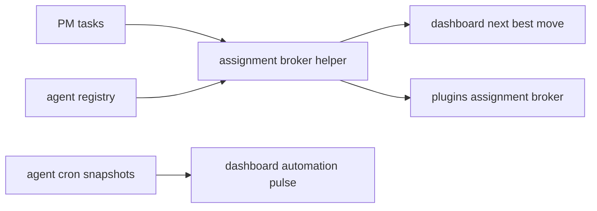

# dashboard + assignment broker pass

## scope

dieser pass hat drei konkrete dinge gebaut:

1. dashboard von statischen widget-karten zu `attention rail + next best move + automation pulse`
2. assignment broker als echte plugin-fläche statt nur roadmap-text
3. agent-beispiel für die cron-api in python

## data flow

## implementation notes

### dashboard

1. `attention rail` mischt overdue tasks, failing cron jobs und stale agents
2. `next best move` nutzt dieselbe scoring-logik wie der plugin-tab
3. `automation pulse` zeigt cron coverage und den nächsten gemeldeten lauf
4. `knowledge freshness` holt die letzten notes direkt ins dashboard

### assignment broker

1. scoring basiert auf task-priority, agent-status, role-match, skill-match und tool-fit
2. `idle` wird bewusst vor `working` bevorzugt
3. agents mit `offline` oder `error` werden komplett ausgeschlossen

### example agent

1. [agent_cron_report.py](C:\Users\matth\OneDrive\Dokumente\GitHub\UMBRA\examples\agent_cron_report.py) postet einen vollständigen cron-snapshot mit stdlib-only python
2. env vars:
   - `UMBRA_UAP`
   - `UMBRA_TOKEN`
   - optional `AGENT_ID`
   - optional `AGENT_NAME`

## touched files

1. [assignment-broker.ts](C:\Users\matth\OneDrive\Dokumente\GitHub\UMBRA\src\lib\assignment-broker.ts)
2. [DashboardView.vue](C:\Users\matth\OneDrive\Dokumente\GitHub\UMBRA\src\views\DashboardView.vue)
3. [PluginsView.vue](C:\Users\matth\OneDrive\Dokumente\GitHub\UMBRA\src\views\PluginsView.vue)
4. [DashboardView.test.ts](C:\Users\matth\OneDrive\Dokumente\GitHub\UMBRA\src\views\__tests__\DashboardView.test.ts)
5. [PluginsView.test.ts](C:\Users\matth\OneDrive\Dokumente\GitHub\UMBRA\src\views\__tests__\PluginsView.test.ts)
6. [agent_cron_report.py](C:\Users\matth\OneDrive\Dokumente\GitHub\UMBRA\examples\agent_cron_report.py)

## verification

1. `npm test` gruen (`15/15`)
2. `npm run build` gruen
3. `cargo test` gruen (`16/16`)
