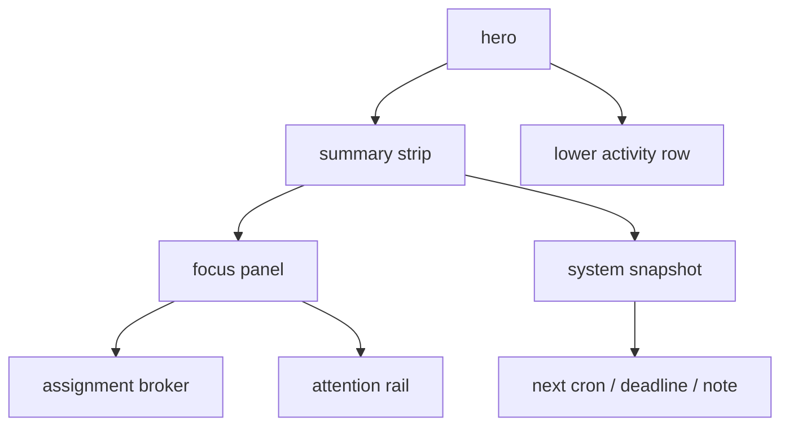

# dashboard clarity pass

## goal

das dashboard war funktional, aber zu laut. dieser pass reduziert die anzahl gleichgewichteter blöcke und zieht die blickführung auf drei ebenen:

1. summary
2. focus
3. activity

## what changed

1. aus vielen ähnlich lauten panels wurden jetzt drei klare zonen
2. `attention rail` und `assignment broker` sitzen zusammen im focus-panel
3. deadlines, cron und note-freshness wurden in `system snapshot` zusammengezogen
4. `live roster` und `recent activity` bleiben als zweite ebene unten

## files

1. [DashboardView.vue](C:\Users\matth\OneDrive\Dokumente\GitHub\UMBRA\src\views\DashboardView.vue)
2. [DashboardView.test.ts](C:\Users\matth\OneDrive\Dokumente\GitHub\UMBRA\src\views\__tests__\DashboardView.test.ts)

## verification

1. `npm test` gruen
2. `npm run build` gruen
