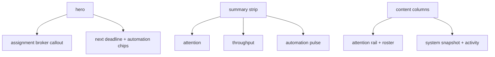

# dashboard design pass

## ziel

das dashboard sollte nicht nur sauberer, sondern auch visuell hochwertiger wirken. der fokus lag auf:

1. stärkerer hero statt normaler kopfzeile
2. klarer primärer callout für den assignment broker
3. weniger generische kachel-optik
4. bessere visuelle rhythmik zwischen focus, summary und detail

## was geändert wurde

1. hero zu einer echten stage mit glow, focus-card und snapshot-chips ausgebaut
2. summary-cards mit accent-strip statt neutraler standard-karten
3. content in zwei ruhigere columns gegliedert
4. typografie angezogen: größerer display-title, dichterer fokus-title, weniger gleich laute panel-headlines
5. light-theme-overrides für die neuen surfaces mitgezogen

## dateien

1. [DashboardView.vue](C:\Users\matth\OneDrive\Dokumente\GitHub\UMBRA\src\views\DashboardView.vue)
2. [DashboardView.test.ts](C:\Users\matth\OneDrive\Dokumente\GitHub\UMBRA\src\views\__tests__\DashboardView.test.ts)

## verifikation

1. `npm test` gruen
2. `npm run build` gruen
