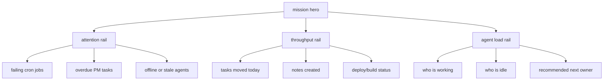
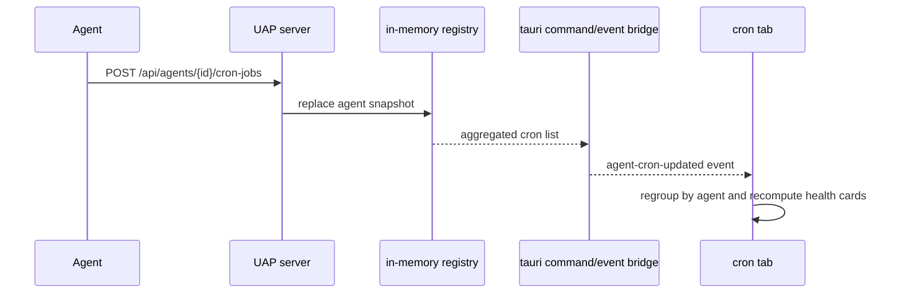

# dashboard, plugins and agent cron architecture

## 1. better dashboard

the current dashboard is fine as a surface, but still too passive. the better version should answer three questions in one glance:

1. what is burning right now
2. which agent should do the next thing
3. what is likely to break in the next few hours

### proposed layout



### recommended dashboard widgets

1. `attention rail`
   - merge failing cron jobs, overdue tasks and stale agents into one red lane
2. `next best move`
   - show the single best next assignment based on PM priority + agent skill fit
3. `automation pulse`
   - summarize cron coverage: jobs reporting, next due, failing, silent agents
4. `delivery rail`
   - combine github issues, recent commits and PM review items into one shipping view
5. `knowledge freshness`
   - show notes or prompts changed in the last 24h and who changed them

## 2. additional plugins worth building

### top 4

1. `release radar`
   - combines PM review, github changes and deployment notes into one release lane
2. `build sentinel`
   - ingests CI, smoke tests and crash signals so UMBRA sees breakage before humans ask
3. `vault graph lens`
   - turns flat notes and skills into linked knowledge clusters
4. `assignment broker`
   - recommends which agent should pick which PM item next

### second wave

1. `artifact watcher`
   - game builds, exports, installers, zip drops
2. `llm cost monitor`
   - token spend, latency, failure rates per agent or workflow
3. `session replay`
   - reconstructs what an agent did from heartbeats, cron pushes and PM comments

## 3. agent cron api

the cron tab is now designed around **snapshot pushes** from agents, not manual local jobs.

### endpoint

1. method: `POST`
2. path: `/api/agents/{id}/cron-jobs`
3. auth header: `X-Agent-Token: <uap token>`
4. behavior: replace that agent's visible cron snapshot with the submitted list

### payload

```json
{
  "agentName": "forge",
  "jobs": [
    {
      "id": "daily-build",
      "job": "daily build",
      "timing": "09:00",
      "recurrence": "weekdays",
      "timezone": "Europe/Berlin",
      "enabled": true,
      "nextRun": "2026-03-21T09:00:00+01:00",
      "lastRun": "2026-03-20T09:00:04+01:00",
      "lastStatus": "ok",
      "notes": "ships internal build + changelog digest",
      "source": "systemd timer",
      "command": "python scripts/build.py"
    }
  ]
}
```

### why snapshot mode

1. agents can restart cleanly and just resend their current truth
2. the frontend does not need to merge partial mutations
3. stale cron rows disappear naturally when an agent republishes fewer jobs

### data flow



## 4. implementation notes

### changed code paths

1. backend registry now stores `AgentCronJob` entries per agent
2. uap exposes `POST /api/agents/{id}/cron-jobs`
3. tauri exposes `list_agent_cron_jobs`
4. cron tab renders grouped agent telemetry instead of local command execution
5. plugins view now includes a visible roadmap section

## 5. step by step for an agent author

1. keep using heartbeat as before
2. after cron schedules are loaded, POST the full schedule snapshot to `/api/agents/{id}/cron-jobs`
3. resend the full snapshot whenever jobs are added, removed, paused or rescheduled
4. include `nextRun`, `lastRun` and `lastStatus` if you want the cron tab to be genuinely useful

## 6. files

1. [uap.rs](C:\Users\matth\OneDrive\Dokumente\GitHub\UMBRA\src-tauri\src\uap.rs)
2. [cron.rs](C:\Users\matth\OneDrive\Dokumente\GitHub\UMBRA\src-tauri\src\commands\cron.rs)
3. [useCronStore.ts](C:\Users\matth\OneDrive\Dokumente\GitHub\UMBRA\src\stores\useCronStore.ts)
4. [CronView.vue](C:\Users\matth\OneDrive\Dokumente\GitHub\UMBRA\src\views\CronView.vue)
5. [PluginsView.vue](C:\Users\matth\OneDrive\Dokumente\GitHub\UMBRA\src\views\PluginsView.vue)
