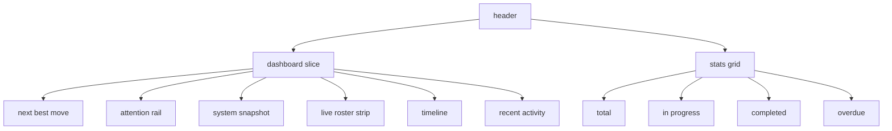

# dashboard pm-inspired redesign

## ziel

das umbra-dashboard sollte ruhiger und näher am pm-tool wirken:

1. eine große `dashboard slice` als primäre fläche
2. konsistente statistik-karten rechts statt vieler gleich lauter boxen
3. klare timeline- und activity-panels darunter
4. weniger glow und weniger visuelles durcheinander

## was geändert wurde

1. hero ist wieder einfacher und weniger show-lastig
2. der inhalt sitzt jetzt in einer großen ruhigen `Umbra Slice`
3. `next best move` bleibt prominent, aber als teil der slice statt als extra hero-card
4. `attention rail`, `system snapshot` und `live roster` teilen dieselbe visuelle grammatik
5. die stats rechts orientieren sich stärker an der pm-tool-dashboard-anordnung

## verifikation

1. `npm test` gruen
2. `npm run build` gruen
