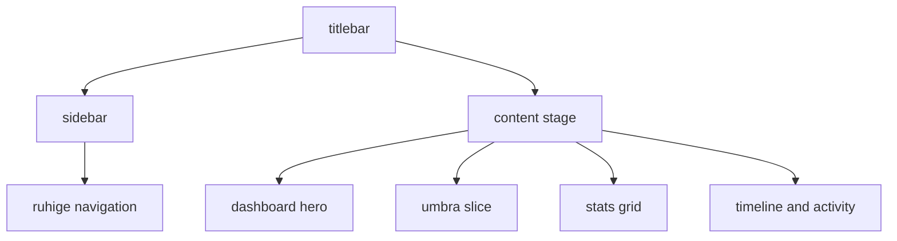

# dashboard shell pixel pass

datum: 2026-03-20

## ziel

das dashboard selbst war bereits besser, aber die app-shell hat weiter dagegen gearbeitet:

1. sidebar zu laut und typografisch zu arcade-lastig
2. titlebar optisch roh und inkonsistent
3. globaler glow zu aktiv fuer eine ruhige pm-tool-anmutung

## umgesetzt

1. sidebar komplett neu aufgebaut
2. titlebar auf ruhige utility-bar reduziert
3. content-stage als saubere buehne fuer das dashboard eingefuehrt
4. dashboard-texte und surfaces leicht beruhigt
5. ambient glow global abgeschwaecht

## dateien

1. [DashboardView.vue](C:\Users\matth\OneDrive\Dokumente\GitHub\UMBRA\src\views\DashboardView.vue)
2. [AppSidebar.vue](C:\Users\matth\OneDrive\Dokumente\GitHub\UMBRA\src\components\layout\AppSidebar.vue)
3. [CustomTitlebar.vue](C:\Users\matth\OneDrive\Dokumente\GitHub\UMBRA\src\components\layout\CustomTitlebar.vue)
4. [AppLayout.vue](C:\Users\matth\OneDrive\Dokumente\GitHub\UMBRA\src\components\layout\AppLayout.vue)
5. [base.css](C:\Users\matth\OneDrive\Dokumente\GitHub\UMBRA\src\assets\styles\base.css)

## design-richtung

1. weniger glow
2. weniger display-font als dauerfeuer
3. klarere hierarchie: brand, nav, content-stage, dashboard-panels
4. ruhigere pill-styles und borders
5. naeher am pm-tool: grosse slice links, stats rechts, timeline und activity unten

## flow

## verifikation

1. `npm test` gruen (`15/15`)
2. `npm run build` gruen

## kritik

1. das ist deutlich sauberer, aber noch kein finaler visual-finish
2. wenn du es noch naeher ans pm-tool willst, ist der naechste logische schritt ein echter spacing-pass ueber alle views, nicht nur dashboard + shell
