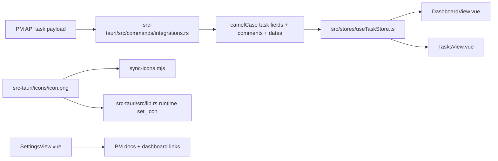

# Dashboard + Taskboard Pass

## Ziel

UMBRA sollte drei konkrete Dinge bekommen:

1. ein dashboard mit derselben informationsarchitektur wie das live-pm-dashboard, aber ohne task-filters
2. task-lanes mit brauchbarem drag-and-drop plus prioritaets-sortierung
3. settings-links zur pm-tool-dokumentation und ein erzwungen korrektes runtime-icon

## Architektur

## Änderungen

### Dashboard

Datei: [DashboardView.vue](C:\Users\matth\OneDrive\Dokumente\GitHub\UMBRA\src\views\DashboardView.vue)

1. hero/header an das pm-dashboard angelehnt
2. alter widget-mix in einen grossen `Current Umbra Slice`-block verschoben
3. stats-karten fuer `Total Tasks`, `In Progress`, `Completed`, `Overdue`
4. `Upcoming Deadlines` und `Recent Activity` aus den echten pm-taskdaten berechnet

### PM-Daten

Dateien:

1. [integrations.rs](C:\Users\matth\OneDrive\Dokumente\GitHub\UMBRA\src-tauri\src\commands\integrations.rs)
2. [index.ts](C:\Users\matth\OneDrive\Dokumente\GitHub\UMBRA\src\interfaces\index.ts)

Neu angereichert:

1. `createdAt`
2. `updatedAt`
3. `deadline`
4. `nextDueDate`
5. `position`
6. `comments`
7. `urgent` priority sauber im frontend-typ

### Tasks

Dateien:

1. [TasksView.vue](C:\Users\matth\OneDrive\Dokumente\GitHub\UMBRA\src\views\TasksView.vue)
2. [TasksView.test.ts](C:\Users\matth\OneDrive\Dokumente\GitHub\UMBRA\src\views\__tests__\TasksView.test.ts)

Neu:

1. drag/drop nicht mehr an `project selected` gegated
2. standardfokus auf projekt `UMBRA`, falls vorhanden
3. lanes rendern stabil ueber `position`
4. `SORT BY PRIORITY` reordert jede lane per `urgent > critical > high > medium > low`
5. `urgent` ist jetzt auch im create/edit flow sichtbar

### Settings

Datei: [SettingsView.vue](C:\Users\matth\OneDrive\Dokumente\GitHub\UMBRA\src\views\SettingsView.vue)

1. `OPEN API DOCS`
2. `OPEN TOOL DASHBOARD`

### Icon

Datei: [lib.rs](C:\Users\matth\OneDrive\Dokumente\GitHub\UMBRA\src-tauri\src\lib.rs)

1. windows-main-window setzt das laufende icon jetzt explizit aus `src-tauri/icons/icon.png`
2. damit ist das grüne placeholder-icon im laufenden tauri-window nicht mehr dem build/glück überlassen

## Verifikation

1. `npm test` grün, `12/12`
2. `npm run build` grün
3. `cargo test` grün, `14/14`
4. browser-pass auf `http://host.docker.internal:4174/#/dashboard`, `#/settings`, `#/tasks`

## Offene ehrliche Grenze

Der browser-pass lief gegen `vite preview`, also browser-mode ohne tauri-runtime. layout und controls sind damit verifiziert, aber nicht die echte runtime-datenbindung im desktop-webview. fuer das taskbar-icon brauchst du deshalb einmal die laufende tauri-app neu starten, damit windows den neuen runtime-icon-pfad auch wirklich zieht.
