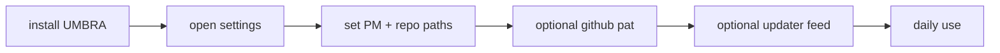

# end user install guide

## installer wählen

1. standard: [UMBRA_0.1.0_x64-setup.exe](C:\Users\matth\OneDrive\Dokumente\GitHub\UMBRA\src-tauri\target\release\bundle\nsis\UMBRA_0.1.0_x64-setup.exe)
2. alternativ: [UMBRA_0.1.0_x64_en-US.msi](C:\Users\matth\OneDrive\Dokumente\GitHub\UMBRA\src-tauri\target\release\bundle\msi\UMBRA_0.1.0_x64_en-US.msi)

## installation

1. installer starten
2. smartscreen bei unsigniertem build bestaetigen
3. UMBRA installieren
4. app starten

## erster start

1. `Settings` oeffnen
2. `api url` setzen
3. `dashboard url` setzen
4. `local repo root` setzen
5. optional `github pat` setzen
6. optional `updater endpoint` + `updater public key` setzen
7. settings speichern

## alltag

1. `dashboard`, `tasks`, `agents`, `cron`, `notes` normal nutzen
2. launcher-local-actions funktionieren nur mit korrektem repo-root
3. `all repos` im launcher braucht einen `github pat`
4. auto-update braucht konfigurierten release-feed + public key

## onboarding-flow

## support-hinweise

1. wenn das taskbar-icon alt aussieht: app neu anheften
2. wenn launcher lokal nichts findet: repo-root pruefen
3. wenn `all repos` leer bleibt: github pat setzen
4. wenn update-check fehlschlaegt: endpoint/pubkey pruefen
