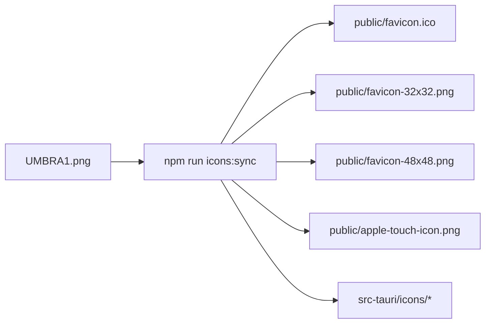

# UMBRA Icon Pipeline

## Quelle

`UMBRA1.png` im repo-root ist die einzige source of truth fuer web- und tauri-icons.

## Flow

## Erzeugte Dateien

1. `public/favicon.ico`
2. `public/favicon-32x32.png`
3. `public/favicon-48x48.png`
4. `public/apple-touch-icon.png`
5. `src-tauri/icons/*`

## Neu erzeugen

1. master-icon in `UMBRA1.png` aktualisieren
2. `npm run icons:sync` ausfuehren
3. optional `npm run build` zur verifikation ausfuehren

## Technischer Hinweis

Der sync laeuft ueber [sync-icons.mjs](C:\Users\matth\OneDrive\Dokumente\GitHub\UMBRA\scripts\sync-icons.mjs) und nutzt `tauri icon` fuer die desktop-assets sowie die benoetigten web-groessen.

## Kritik, ehrlich

`UMBRA1.png` als master-dateiname ist funktional, aber nicht schoen. Wenn du das branding spaeter sauberer haben willst, benennen wir es in etwas wie `branding/umbra-icon-master.png` um und passen den script einmal an.
