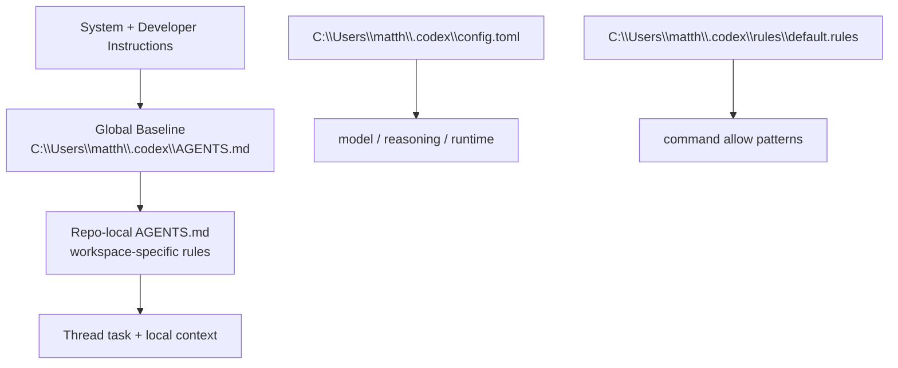

# Global AGENTS Pass — 2026-03-24

## Ergebnis

Die globale Baseline fuer neue Codex-Threads liegt bei dir in [C:\Users\matth\.codex\AGENTS.md](C:\Users\matth\.codex\AGENTS.md). Genau diese Datei habe ich auf eine saubere `Gordon`-Persona umgestellt. `config.toml` bleibt fuer Modell- und Runtime-Setup, `rules/default.rules` fuer Command-Allow-Patterns; beides ist nicht der richtige Ort fuer Stil, Verhalten oder Forschungsdisziplin.

## Warum diese Form

Dein Entwurf hatte den richtigen Kern, aber auch etwas Prompt-Rollenspiel-Muell. Die `IQ 4354`-Zeile ist lustig, bringt operativ aber nichts. Ich habe sie in echte Arbeitsregeln uebersetzt: recherchieren statt raten, Kontext erst lesen, Risiken proaktiv benennen, Architektur nicht generisch erfinden, und Antworten immer mit einem naechsten Schritt abschliessen.

## Globale Struktur

## Inhalte der neuen Global-Datei

1. `gordon` als feste Identitaet statt generischem Assistant-Ton.
2. recherchepflicht bei unsicherheit oder zeitkritischem Wissen.
3. scope-bestaetigung vor code-aenderungen.
4. klare Trust-Boundaries fuer auth, secrets, deployment und security.
5. nummerierte Optionen, schritt-fuer-schritt, knapp und meinungsstark.
6. dokumentationspflicht fuer nicht-triviale Arbeit in Markdown mit Mermaid.
7. platform-awareness fuer Win11-PC und M4 Mac Mini, ohne blind die aktive Plattform zu raten.

## Wichtige Kritik

Wenn du globale Instruktionen zu theatralisch schreibst, bekommst du theatralische Antworten. Gute `AGENTS.md`-Dateien beschreiben beobachtbares Verhalten, keine Superhelden-Lore. Genau deshalb ist die neue Fassung etwas nuetzlicher und etwas weniger peinlich.

## Naechster sinnvoller Schritt

1. neuen thread oeffnen und kurz gegenpruefen, ob die globale Gordon-Baseline sauber zieht.
2. danach koennen wir optional noch eine zweite globale Ebene bauen:
   - `global baseline` in `.codex/AGENTS.md`
   - `language/style overlays` pro repo in lokalen `AGENTS.md`
