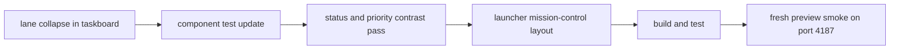

# lane collapse + contrast + launcher mission-control pass - 2026-03-22

## scope

dieser pass hat drei konkrete follow-ups zusammengezogen:

1. taskboard-spalten selbst collapsible machen, nicht nur einzelne cards
2. light-theme-kontrast fuer pills und status-zustaende haerten
3. den launcher von einer util-view zu einer ruhigeren mission-control-flaeche umbauen

## umgesetzt

### 1. lane-level collapse im taskboard

- [TasksView.vue](C:\Users\matth\OneDrive\Dokumente\GitHub\UMBRA\src\views\TasksView.vue)
- jede lane hat jetzt oben rechts einen eigenen toggle
- collapsed lanes zeigen `+`, expanded lanes `-`
- `done` startet standardmaessig als ganze lane collapsed
- im collapsed state bleibt eine kleine summary-flaeche sichtbar mit hidden-count und `expand lane`
- der task-card-toggle bleibt erhalten, aber die groessere ruhe kommt jetzt schon auf spaltenebene

### 2. test-absicherung fuer lane + card collapse

- [TasksView.test.ts](C:\Users\matth\OneDrive\Dokumente\GitHub\UMBRA\src\views\__tests__\TasksView.test.ts)
- test deckt jetzt ab:
  1. done-lane startet collapsed
  2. hidden-summary wird angezeigt
  3. nach expand ist die done-card sichtbar
  4. die done-card selbst startet weiterhin collapsed und laesst sich aufklappen

### 3. kontrast-pass fuer status-badges und prioritaeten

- [StatusBadge.vue](C:\Users\matth\OneDrive\Dokumente\GitHub\UMBRA\src\components\ui\StatusBadge.vue)
- [TasksView.vue](C:\Users\matth\OneDrive\Dokumente\GitHub\UMBRA\src\views\TasksView.vue)
- status-badges nutzen jetzt dieselbe ruhigere control-sprache wie der rest der shell
- im light theme wurden online/working/idle/offline/error mit dunklerem text und klareren borders neu gezogen
- task-priority-pills im light theme wurden ebenfalls haerter abgestimmt, damit `critical`, `urgent`, `high`, `medium` und `low` nicht mehr verwaschen wirken

### 4. launcher als mission-control layout

- [LauncherView.vue](C:\Users\matth\OneDrive\Dokumente\GitHub\UMBRA\src\views\LauncherView.vue)
- neuer summary-strip fuer `ides`, `all repos`, `pinned repos` und `repo signal`
- stage-layout mit klarer linker fokusflaeche fuer ide-launching und rechter repo-stack fuer repo-kontext
- ruhigeres typography-/surface-system statt verstreuter utility-panels
- light-theme controls fuer `refresh`, `open` und launcher-icons nachgezogen

## verifikation

1. `npm test` gruen, `15/15`
2. `npm run build` gruen

## browser smoke

lokale preview lief frisch auf `http://host.docker.internal:4187`.

geprueft:

1. settings auf light theme gestellt und persistent gespeichert
2. launcher-layout in der frischen preview geoeffnet
3. computed styles fuer launcher-controls im light theme geprueft
4. agents-view geladen, um badge-surfaces gegen live-render zu pruefen

festgestellt:

1. launcher zeigt das neue summary-grid sauber im light theme
2. task-lane-collapse konnte live nicht mit echten daten geprueft werden, weil die preview in dieser session keine aktiven tasks geladen hatte
3. status-badge-light-theme war code-seitig fertig, aber live nicht voll sichtbar, weil in der preview keine agent-cards vorhanden waren
4. die funktionalen teile fuer task-collapse sind deshalb ueber den komponententest abgesichert

## flow

## kritik

1. lane-collapse bringt sofort mehr ruhe, aber `review` sollte als naechstes vermutlich ebenfalls standardmaessig collapsed starten
2. der launcher ist jetzt endlich eine brauchbare stage, aber die naechste inhaltliche stufe waere echte quick-actions pro repo statt nur ruhigerer darstellung
3. fuer einen wirklich harten wcag-pass fehlt noch eine systematische farbmessung ueber alle pills, links und tabellenstates hinweg
