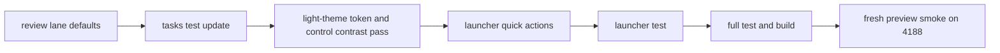

# lane defaults + wcag pass + launcher actions - 2026-03-22

## scope

dieser pass hat die letzten drei sinnvollen follow-ups verbunden:

1. `review` neben `done` standardmaessig als lane ruhiger machen
2. den light-theme-kontrast nicht mehr nur punktuell, sondern ueber die gemeinsamen ui-surfaces haerten
3. dem launcher echte quick-actions pro ide und repo geben

## umgesetzt

### 1. lane defaults im taskboard

- [TasksView.vue](C:\Users\matth\OneDrive\Dokumente\GitHub\UMBRA\src\views\TasksView.vue)
- `review` ist jetzt wie `done` als lane default-collapsed
- lanes kollabieren aber nur dann wirklich, wenn tasks darin liegen
- leere lanes bleiben offen und zeigen weiter `no tasks`, statt sinnlos `0 hidden`

### 2. test-absicherung fuer lane-defaults

- [TasksView.test.ts](C:\Users\matth\OneDrive\Dokumente\GitHub\UMBRA\src\views\__tests__\TasksView.test.ts)
- test deckt jetzt ab:
  1. review-lane startet collapsed, wenn review-items existieren
  2. done-lane startet weiterhin collapsed
  3. nach expand bleibt die card selbst zunaechst reduziert

### 3. globalerer kontrast-pass

- [base.css](C:\Users\matth\OneDrive\Dokumente\GitHub\UMBRA\src\assets\styles\base.css)
- [glassmorphism.css](C:\Users\matth\OneDrive\Dokumente\GitHub\UMBRA\src\assets\styles\glassmorphism.css)
- [NeonButton.vue](C:\Users\matth\OneDrive\Dokumente\GitHub\UMBRA\src\components\ui\NeonButton.vue)
- [GlassCard.vue](C:\Users\matth\OneDrive\Dokumente\GitHub\UMBRA\src\components\ui\GlassCard.vue)

konkret:

1. light-theme-tokens wurden dunkler und sauberer getrennt
2. borders und glass-surfaces tragen jetzt mehr kontrast
3. inputs, cards und secondary/ghost-buttons sind im hellen theme klarer lesbar
4. globale `focus-visible`-outlines und link-kontrast wurden nachgezogen

### 4. launcher quick-actions

- [LauncherView.vue](C:\Users\matth\OneDrive\Dokumente\GitHub\UMBRA\src\views\LauncherView.vue)
- ide-cards haben jetzt:
  1. `launch`
  2. `copy path`
- all-repos-select hat jetzt:
  1. `open repo`
  2. `copy link`
- pinned repos haben jetzt:
  1. `open`
  2. `copy link`

### 5. launcher-test

- [LauncherView.test.ts](C:\Users\matth\OneDrive\Dokumente\GitHub\UMBRA\src\views\__tests__\LauncherView.test.ts)
- testet, dass quick-actions gerendert werden und clipboard-copy fuer ide-path und repo-link feuert

## verifikation

1. `npm test` gruen, `16/16`
2. `npm run build` gruen
3. gezielter vitest-lauf fuer tasks + launcher ebenfalls gruen

## browser smoke

frische preview auf `http://host.docker.internal:4188`.

geprueft:

1. tasks-empty-state zeigt `review` und `done` nicht sinnlos collapsed, solange keine items darin liegen
2. launcher rendert den neuen stage-aufbau mit all-repos-controls
3. computed styles fuer launcher-controls wurden gelesen

einschraenkungen:

1. in der preview waren keine ide-targets konfiguriert
2. in der preview waren keine pinned repos vorhanden
3. deshalb sind die neuen launcher quick-actions live nur ueber den empty-state und test abgedeckt, nicht ueber echte klickbare cards

## flow

## kritik

1. das taskboard ist jetzt ruhiger, aber `backlog` bleibt die naechste offensichtliche kandidat-lane fuer optionalen default-collapse bei grossen boards
2. der kontrast-pass ist jetzt systemischer als vorher, aber kein mathematischer voll-wcag-audit mit jeder einzelnen state-kombination
3. der launcher ist funktionaler, aber der naechste starke schritt waere repo-spezifische quick-actions wie `open issues`, `open pr`, `copy ssh/https`
