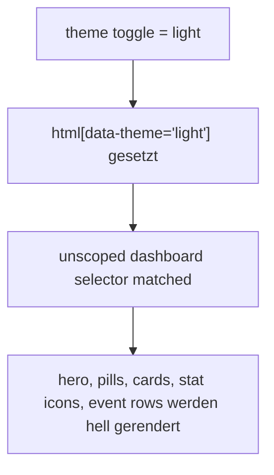

# light theme dashboard fix

## problem

im dashboard blieb der hero-bereich im light theme dunkel, obwohl der rest der app bereits auf helle textfarben umgestellt hatte. ursache war kein theme-store-fehler, sondern eine falsche kombination aus vue `scoped` css und globalen `[data-theme="light"]` selektoren.

## fix

1. die light-theme-overrides wurden aus dem `scoped` block entfernt.
2. die theme-spezifischen dashboard-regeln liegen jetzt in einem separaten unscoped `<style>` block.
3. die selektoren greifen explizit auf `.dashboard-view` und die betroffenen elemente, damit die styles stabil im browser ankommen.

## verification

1. `npm run build` gruen
2. `npm test` gruen (`12/12`)
3. browser-check auf `http://host.docker.internal:4174/#/dashboard`:
   - `heroBackground` = heller gradient
   - `heroBorder` = `rgba(8, 145, 178, 0.16)`
   - `cardBackground` = `rgba(255, 255, 255, 0.72)`

## files

1. [DashboardView.vue](C:\Users\matth\OneDrive\Dokumente\GitHub\UMBRA\src\views\DashboardView.vue)
2. [light-theme-dashboard-fix-2026-03-20.md](C:\Users\matth\OneDrive\Dokumente\GitHub\UMBRA\docs\light-theme-dashboard-fix-2026-03-20.md)
