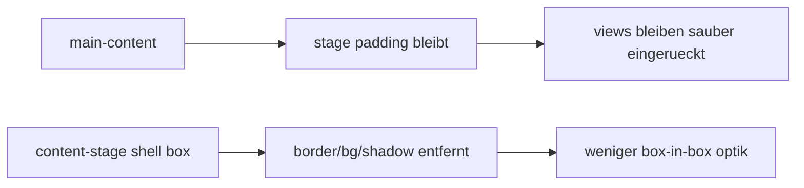

# mainframe shell box removal pass

## ziel

1. die große box um den gesamten mainframe entfernen
2. alle views direkt auf der stage liegen lassen statt in einer zusätzlichen shell-card

## umgesetzt

1. `content-stage` in `AppLayout` hat keine eigene border, keinen background, keinen shadow und keinen radius mehr
2. das view-padding bleibt erhalten, damit die views nicht an den rand kippen
3. der globale error-fallback bleibt unberührt

## flow

## betroffene datei

1. `src/components/layout/AppLayout.vue`

## kritik

1. die shell-box war visuell redundant
2. der hero und die view-panels tragen schon genug struktur, die extra rahmung davor hat nur doppelt gerahmt
