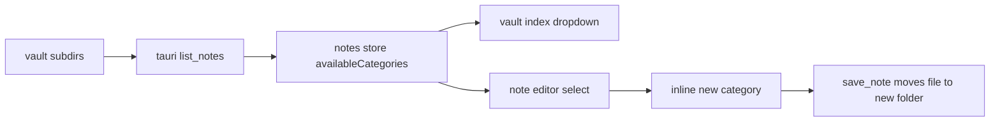

# notes categories pass

## ziel

notes-kategorien sind jetzt nicht mehr auf eine feste liste verdrahtet. der vault-index filtert per dropdown, und im editor kann direkt eine neue kategorie angelegt werden.

## änderungen

1. frontend-kategorien werden aus den geladenen notes abgeleitet statt aus einer harten union.
2. der note-editor kann neue kategorien inline anlegen und sofort auf die aktive note anwenden.
3. `list_notes` liest im tauri-backend alle gültigen unterordner unter `UMBRA_Notes/` dynamisch ein.
4. category-validierung bleibt strikt gegen path traversal und windows-reservierte namen.

## datenfluss

## validierung

1. `npx vitest run src/components/notes/__tests__/NoteEditor.test.ts src/stores/__tests__/useNotesStore.test.ts src/views/__tests__/NotesView.test.ts`
2. `cargo test --manifest-path src-tauri/Cargo.toml notes`
3. voller pass folgt über `npm test`, `cargo test --manifest-path src-tauri/Cargo.toml` und `npm run build`
