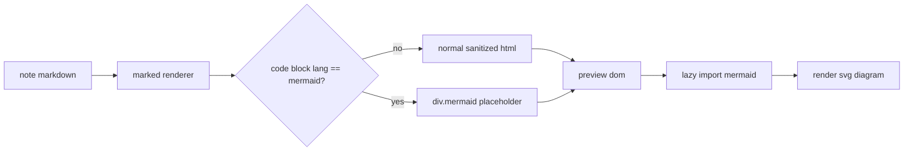

# notes preview + mermaid pass - 2026-03-23

## ziel

die notes-ansicht sollte nicht mehr stur immer im split-view laufen. stattdessen gibt es jetzt explizite modi fuer `markdown`, `split` und `preview`. zusaetzlich rendert die preview jetzt fenced `mermaid`-bloeke als diagramme.

## umgesetzt

1. `NoteEditor` hat einen view-mode toggle bekommen.
2. markdown-preview bleibt bei `marked + dompurify`, aber `mermaid` code fences werden als diagramm-container ausgegeben.
3. mermaid wird lazy geladen und nur dann initialisiert, wenn im preview wirklich `.mermaid`-bloeke auftauchen.
4. gezielte tests decken mode-switching und mermaid-rendering ab.

## flow

## dateien

1. `src/components/notes/NoteEditor.vue`
2. `src/components/notes/__tests__/NoteEditor.test.ts`
3. `package.json`
4. `package-lock.json`

## validierung

1. `npx vitest run src/components/notes/__tests__/NoteEditor.test.ts src/views/__tests__/NotesView.test.ts`
2. `npm test`
3. `npm run build`

## tradeoff

1. mermaid bringt einen spuerbaren extra chunk mit. die implementation laedt ihn aber erst, wenn eine note im preview tatsaechlich mermaid-blocks enthaelt. fuer normale text-notes bleibt der baseline-flow leichtgewichtiger.
