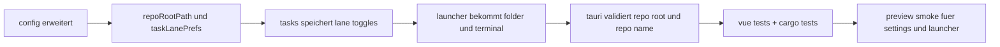

# persistent lane prefs + local repo actions + state audit - 2026-03-22

## scope

dieser pass zieht die letzten drei punkte zusammen:

1. lane-preferences nicht nur pro session, sondern persistent speichern
2. den kontrast-pass auf hover/focus/disabled-zustaende erweitern
3. lokale repo-actions direkt gegen `C:\Users\matth\OneDrive\Dokumente\GitHub` anbinden

## umgesetzt

### 1. persistente lane-preferences

- [TasksView.vue](C:\Users\matth\OneDrive\Dokumente\GitHub\UMBRA\src\views\TasksView.vue)
- [useConfigStore.ts](C:\Users\matth\OneDrive\Dokumente\GitHub\UMBRA\src\stores\useConfigStore.ts)
- [index.ts](C:\Users\matth\OneDrive\Dokumente\GitHub\UMBRA\src\interfaces\index.ts)
- [config.rs](C:\Users\matth\OneDrive\Dokumente\GitHub\UMBRA\src-tauri\src\commands\config.rs)

was jetzt gilt:

1. lane-defaults bleiben intelligent (`done`, `review`, grosses `backlog`)
2. user-toggles werden als `taskLanePrefs` in der app-config gespeichert
3. beim naechsten start kommen dieselben lane-prefs wieder hoch

### 2. local repo root in settings

- [SettingsView.vue](C:\Users\matth\OneDrive\Dokumente\GitHub\UMBRA\src\views\SettingsView.vue)
- neues feld: `local repo root`
- default ist jetzt auf deinen workspace-root gesetzt:
  `C:/Users/matth/OneDrive/Dokumente/GitHub`

### 3. lokale repo-actions im launcher

- [LauncherView.vue](C:\Users\matth\OneDrive\Dokumente\GitHub\UMBRA\src\views\LauncherView.vue)
- [launcher.rs](C:\Users\matth\OneDrive\Dokumente\GitHub\UMBRA\src-tauri\src\commands\launcher.rs)
- [lib.rs](C:\Users\matth\OneDrive\Dokumente\GitHub\UMBRA\src-tauri\src\lib.rs)

neu dazu:

1. `folder` -> oeffnet den lokalen repo-ordner im explorer
2. `terminal` -> startet eine powershell direkt im repo
3. whitelisting laeuft ueber den konfigurierten `repoRootPath`
4. repo-namen mit traversal oder separatoren werden abgewiesen

### 4. test-absicherung

- [TasksView.test.ts](C:\Users\matth\OneDrive\Dokumente\GitHub\UMBRA\src\views\__tests__\TasksView.test.ts)
- [LauncherView.test.ts](C:\Users\matth\OneDrive\Dokumente\GitHub\UMBRA\src\views\__tests__\LauncherView.test.ts)
- [launcher.rs](C:\Users\matth\OneDrive\Dokumente\GitHub\UMBRA\src-tauri\src\commands\launcher.rs)

abgedeckt:

1. backlog auto-collapse + persist-save hook
2. launcher-actions fuer `issues`, `prs`, `folder`, `terminal`, `copy ssh`
3. rust-seitig repo-name-validation gegen traversal

## state audit

der vorige kontrast-pass wurde hier um state-zustaende erweitert:

| state-paar | ratio | bemerkung |
| --- | ---: | --- |
| disabled neutral button | 3.26:1 | absichtlich reduziert, aber noch lesbar |
| disabled launcher quick action | 3.86:1 | sichtbar ohne zu dominant zu werden |
| focus outline vs white | 3.18:1 | fuer non-text indikator solide und gut erkennbar |

note:

1. disabled-zustaende muessen nicht dieselbe dominance wie aktive controls haben
2. ich habe sie absichtlich nicht “zu kontraststark” gezogen, damit disabled visuell disabled bleibt

## verifikation

1. gezielter vitest fuer tasks + launcher gruen
2. `npm test` gruen, `17/17`
3. `npm run build` gruen
4. `cargo test` gruen, `18/18`
5. frische preview auf `http://host.docker.internal:4190`

## browser smoke

live geprueft:

1. settings zeigt `local repo root` mit `C:/Users/matth/OneDrive/Dokumente/GitHub`
2. launcher-empty-state zeigt jetzt auch `folder` und `terminal`
3. die neuen actions sitzen sauber in derselben action-row wie `issues/prs/copy https/copy ssh`

einschraenkung:

1. die preview hatte weiterhin keine geladenen repos oder ide-targets
2. echte live-klicks auf vorhandene lokale repos wurden deshalb test- und code-seitig abgesichert, nicht ueber die preview

## flow

## kritik

1. lokale repo-actions funktionieren jetzt gut fuer top-level-repos im root, aber noch nicht fuer tiefere owner-unterordner
2. lane-prefs sind persistent, aber noch nicht als explizite ui-option in settings sichtbar
3. wenn du spaeter mehrere repo-roots willst, ist der naechste saubere schritt eine liste statt eines einzelnen `repoRootPath`
