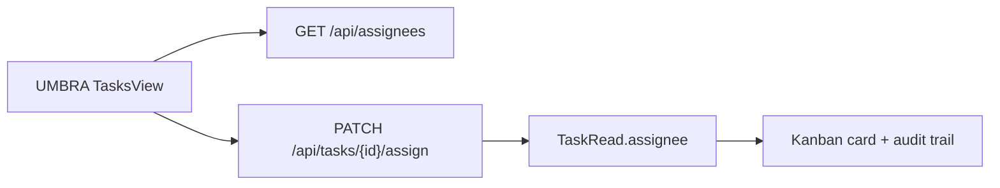

# pm assignment contract - 2026-03-20

## problem

im aktuellen sichtbaren pm-openapi existieren:

1. `create`
2. `update`
3. `move`
4. `reorder`
5. `comment`

es fehlt aber alles rund um echte task-zuweisung:

1. kein `assignee_id`
2. kein `assignee_name`
3. kein `PATCH /api/tasks/{id}/assign`
4. kein endpoint fuer `GET /api/agents` oder `GET /api/users`

damit ist `UMBRA - B2` heute technisch kein frontend-rest mehr, sondern ein backend-gap.

## zielbild

task-zuweisung soll leichtgewichtig bleiben und zur vorhandenen kanban-api passen.



## vorgeschlagene datenstruktur

### assignee read-model

```json
{
  "id": "forge",
  "name": "Forge",
  "kind": "agent",
  "status": "online"
}
```

### task read-model ergaenzung

```json
{
  "id": "task-123",
  "title": "ship notes flow",
  "assignee_id": "forge",
  "assignee_name": "Forge"
}
```

## minimale api

### 1. liste verfuegbarer assignees

`GET /api/assignees`

response:

```json
[
  { "id": "forge", "name": "Forge", "kind": "agent", "status": "online" },
  { "id": "prism", "name": "Prism", "kind": "agent", "status": "idle" },
  { "id": "jim", "name": "Jim", "kind": "agent", "status": "offline" }
]
```

### 2. task zuweisen oder entzuweisen

`PATCH /api/tasks/{task_id}/assign`

request:

```json
{
  "assignee_id": "forge"
}
```

unassign:

```json
{
  "assignee_id": null
}
```

response:

```json
{
  "id": "task-123",
  "title": "ship notes flow",
  "assignee_id": "forge",
  "assignee_name": "Forge"
}
```

## backend-regeln

1. `assignee_id` darf `null` sein
2. unbekannte ids geben `404` oder `422`
3. assignment erzeugt einen audit-comment oder activity-event
4. `TaskRead` liefert assignee immer mit, damit das frontend keinen extra join braucht

## frontend-integration fuer UMBRA

1. `get_pm_tasks` mappt `assigneeId` und `assigneeName` direkt ins task-model
2. `TasksView` zeigt ein kompaktes assignee-pill auf der karte
3. edit-modal bekommt ein assignee-select
4. drag-kanban bleibt unveraendert; assignment ist orthogonal zum lane-move

## bewusst nicht im ersten schritt

1. multi-assignee
2. workload-balancing
3. auto-assignment
4. rechte/permissions

## empfohlene umsetzung

1. pm-backend erweitert `TaskRead` und `TaskUpdate`
2. neuer endpoint `PATCH /api/tasks/{id}/assign`
3. neuer endpoint `GET /api/assignees`
4. danach kann `UMBRA - B2` sauber geschlossen werden
