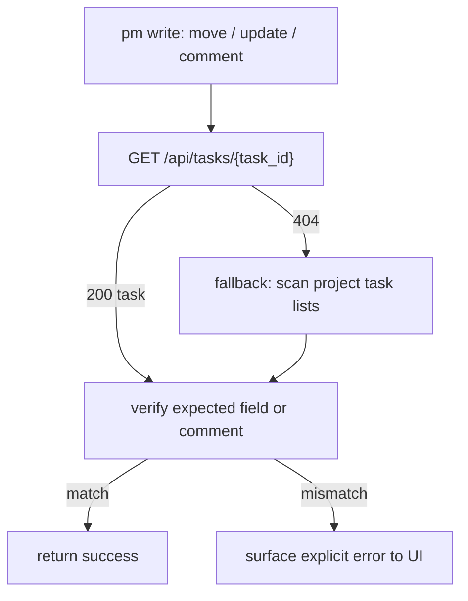

# PM Task Lookup Contract

date: 2026-03-24
consumer: `UMBRA`
api: `http://100.115.61.30:8000`
endpoint: `GET /api/tasks/{task_id}`

## Context

umbra verifies pm write operations after `move`, `update`, and `comment`. the old fallback path had to sweep all projects and scan every `/api/projects/{id}/tasks` list to find one task again.

that was honest, but wasteful.

the live openapi on 2026-03-24 already exposes a direct task lookup route, so this contract locks down how umbra expects to use it.

## Observed Live Contract

from the current openapi:

- `GET /api/tasks/{task_id}`
- success response: `200 application/json`
- response schema: `TaskRead`
- missing task: implicit `404`
- validation errors: `422`

## Required Semantics

### Request

- path param `task_id: string`
- no auth changes relative to the current pm tool deployment

### Success

- `200 OK`
- body must be a full `TaskRead` object, not a partial delta
- the payload should include the fields umbra already relies on elsewhere:
  - `id`
  - `project_id`
  - `column_id`
  - `title`
  - `description`
  - `priority`
  - `comments`
  - `created_at`
  - `updated_at`
  - optional scheduling fields like `deadline` and `next_due_date`

### Not Found

- `404 Not Found`
- this should mean the task truly does not exist, not “lookup unsupported”

### Errors

- if the route fails, it should return structured json error bodies, not html or empty bodies

## UMBRA Runtime Expectation

umbra now prefers direct lookup first and only falls back to project-list scanning when direct lookup does not return a task.

## Why This Matters

1. direct lookup makes post-write verification cheap and deterministic.
2. it avoids scanning every project just to confirm one mutation.
3. it gives the backend one canonical read shape for task detail, instead of forcing clients to reverse-engineer task state from list endpoints.

## Follow-Up

1. keep `TaskRead` stable across both list and single-task routes.
2. if older pm deployments exist without this route, keep the fallback scan until those instances are gone.
3. once the backend contract is stable everywhere, umbra can drop the expensive fallback and trust `GET /api/tasks/{task_id}` as the single verification path.
