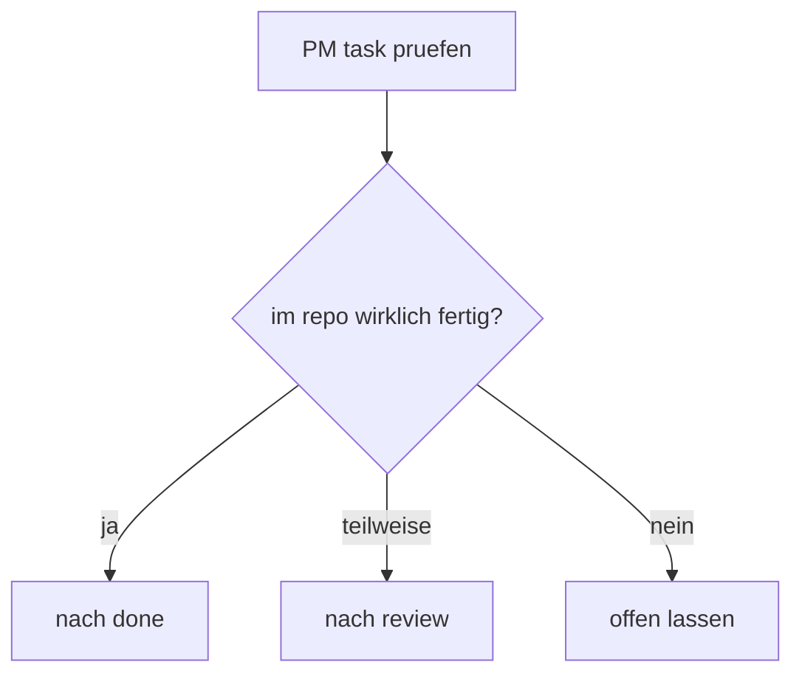

# pm tool status sync

## ziel

die offenen UMBRA-karten im PM-tool gegen den echten repo- und release-stand abgleichen und nur die sauber belegten kandidaten verschieben.

## move-logik

## verschoben

1. `[Feature] Windows 11 Mica-Effekt / Acrylic Transparency fuer Fenster`
   grund: echter Mica-call ist aktiv, release-build und smoke sind gelaufen.
   ziel: `done`
2. `[Setup] Auto-Updater Mechanismus implementieren (Tauri updater plugin)`
   grund: updater-core ist real im repo, aber signed live-feed und release-notes/toast fehlen noch.
   ziel: `review`

## bewusst offen gelassen

1. `[Testing] Rust command tests: expand coverage`
   grund: mehr tests sind da, aber der task nennt weiterhin explizit das >60-prozent-ziel ohne gemessene coverage.
2. `UMBRA - A: Performance Pass remainder`
   grund: letzter audit-punkt ist weiterhin nicht hart entschieden oder verworfen.
3. `UMBRA - B2: PM Tool assignment only (drag kanban done)`
   grund: frontend ist fertig, assignment bleibt ein PM-api-blocker.
4. `[Setup] Windows Build Pipeline einrichten (GitHub Actions -> .msi Installer)`
   grund: lokale installer-builds existieren, aber keine echte CI-pipeline.
5. `[Release] Build-Pipeline & Auto-Update`
   grund: release-flow lokal ist da, signed live-update-feed und CI fehlen.
6. `[Deploy] README + Dokumentation aktualisieren (Setup-Anleitung, Screenshots)`
   grund: docs sind deutlich besser, aber README und screenshots sind noch nicht sauber abgeschlossen.

## board-stand nach sync

1. backlog: `17`
2. in progress: `4`
3. review: `1`
4. done: `48`

## hinweis

beim PM-tool laeuft echtes verschieben ueber `PATCH /api/tasks/{id}/move`. `PUT /api/tasks/{id}` aktualisiert den task-inhalt, bewegt ihn aber nicht zwischen spalten.
