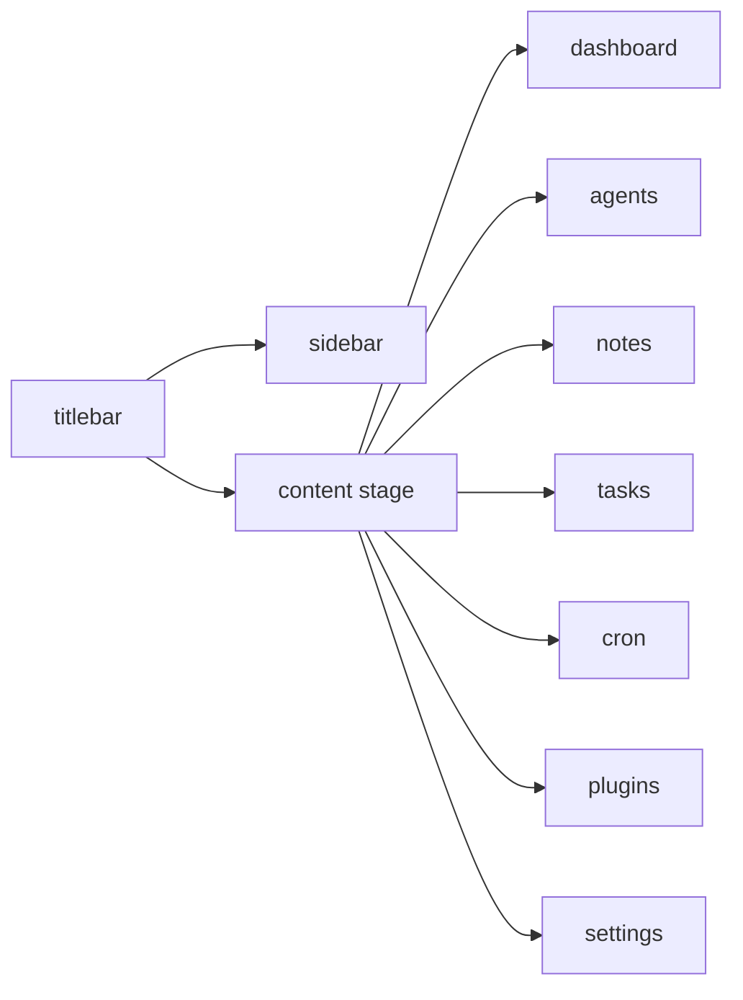

# pm-tool visual parity + qa

datum: 2026-03-20

## ziel

die hauptviews sollten nicht mehr wie einzelne stilwelten wirken. ziel war:

1. dieselbe ruhige shell wie beim dashboard
2. weniger arcade-restoptik
3. browser-qa mit echten screenshots statt nur build/tests

## umgesetzte views

1. [AppSidebar.vue](C:\Users\matth\OneDrive\Dokumente\GitHub\UMBRA\src\components\layout\AppSidebar.vue)
2. [CustomTitlebar.vue](C:\Users\matth\OneDrive\Dokumente\GitHub\UMBRA\src\components\layout\CustomTitlebar.vue)
3. [AgentsView.vue](C:\Users\matth\OneDrive\Dokumente\GitHub\UMBRA\src\views\AgentsView.vue)
4. [AgentCard.vue](C:\Users\matth\OneDrive\Dokumente\GitHub\UMBRA\src\components\agents\AgentCard.vue)
5. [NotesView.vue](C:\Users\matth\OneDrive\Dokumente\GitHub\UMBRA\src\views\NotesView.vue)
6. [NoteEditor.vue](C:\Users\matth\OneDrive\Dokumente\GitHub\UMBRA\src\components\notes\NoteEditor.vue)
7. [TasksView.vue](C:\Users\matth\OneDrive\Dokumente\GitHub\UMBRA\src\views\TasksView.vue)
8. [CronView.vue](C:\Users\matth\OneDrive\Dokumente\GitHub\UMBRA\src\views\CronView.vue)
9. [PluginsView.vue](C:\Users\matth\OneDrive\Dokumente\GitHub\UMBRA\src\views\PluginsView.vue)
10. [SettingsView.vue](C:\Users\matth\OneDrive\Dokumente\GitHub\UMBRA\src\views\SettingsView.vue)
11. [vite.config.ts](C:\Users\matth\OneDrive\Dokumente\GitHub\UMBRA\vite.config.ts)

## design-richtung

1. weniger glow und weniger schreiende display-font
2. klare shell: titlebar -> sidebar -> content-stage
3. ruhigere pills, borders und card-radien
4. mehr pm-tool-anmutung in spacing und hierarchy
5. ascii statt kaputter glyphen

## layout-flow

## qa-pass

lokale preview:

1. `http://host.docker.internal:4181/#/dashboard`

abgenommene routes:

1. `#/dashboard`
2. `#/tasks`
3. `#/agents`
4. `#/notes`
5. `#/plugins`
6. `#/settings`
7. `#/cron`

screenshots:

1. `../tmp/playwright-output/page-2026-03-20T15-51-47-329Z.png` dashboard
2. `../tmp/playwright-output/page-2026-03-20T15-51-57-820Z.png` tasks
3. `../tmp/playwright-output/page-2026-03-20T15-52-13-617Z.png` agents
4. `../tmp/playwright-output/page-2026-03-20T15-52-24-966Z.png` notes
5. `../tmp/playwright-output/page-2026-03-20T15-52-35-244Z.png` plugins
6. `../tmp/playwright-output/page-2026-03-20T15-52-44-744Z.png` settings
7. `../tmp/playwright-output/page-2026-03-20T15-52-53-646Z.png` cron

console health:

1. keine browser-fehler im qa-pass

## verifikation

1. `npm test` gruen (`15/15`)
2. `npm run build` gruen

## befund

1. dashboard, notes und settings sind jetzt klar ruhiger und naeher am pm-tool
2. agents profitiert stark von der neuen roster- und telemetry-aufteilung
3. plugins und cron sitzen jetzt sichtbar in derselben shell-familie
4. tasks ist besser, aber immer noch die dichteste view im system

## ehrliche restkritik

1. das taskboard wirkt jetzt konsistenter, aber noch nicht ganz so entspannt wie dashboard oder settings
2. wenn du noch einen schritt willst, waere ein eigener `taskboard density pass` sinnvoll: weniger display-font, mehr vertikaler rhythmus, noch ruhigere column-header
