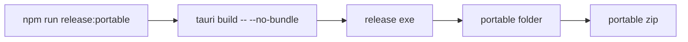

# portable release pass

## ziel

neben installer und msi gibt es jetzt auch eine echte portable windows-ausgabe ohne setup.

## build-flow

## artefakte

1. `dist-portable/UMBRA_<version>_x64_portable/UMBRA.exe`
2. `dist-portable/UMBRA_<version>_x64_portable/README.txt`
3. `dist-portable/UMBRA_<version>_x64_portable.zip`

## technisch

1. script in [build-portable.mjs](C:\Users\matth\OneDrive\Dokumente\GitHub\UMBRA\scripts\build-portable.mjs)
2. npm command in [package.json](C:\Users\matth\OneDrive\Dokumente\GitHub\UMBRA\package.json)
3. output absichtlich in `dist-portable/`, damit installer und portable sauber getrennt bleiben

## hinweis

1. portable heißt hier bewusst: kein installer, einfach entpacken und `UMBRA.exe` starten
2. webview2 bleibt system-voraussetzung, was auf win11 normal okay ist
