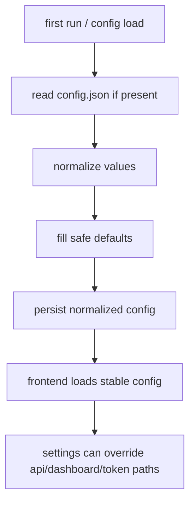

# production hardening pass

## ziel

UMBRA sollte nicht mehr mit persönlicher lokalkonfiguration, festen team-urls oder impliziten account-fallbacks ausliefern. der pass zieht die app auf einen neutralen, erststart-tauglichen standard.

## geändert

1. frontend-defaults in [useConfigStore.ts](C:\Users\matth\OneDrive\Dokumente\GitHub\UMBRA\src\stores\useConfigStore.ts) auf machine-neutrale werte gesetzt.
2. `pmToolDashboardUrl` als eigenes config-feld ergänzt in [index.ts](C:\Users\matth\OneDrive\Dokumente\GitHub\UMBRA\src\interfaces\index.ts).
3. rust-configkern in [config.rs](C:\Users\matth\OneDrive\Dokumente\GitHub\UMBRA\src-tauri\src\commands\config.rs) gehärtet:
   - generischer default ohne persönliche repos, launch-targets und fixe service-urls
   - token-generierung via uuid
   - normalize-pfad für theme, urls, poll-interval, repo-targets und custom-agents
   - first-run-persistenz der generierten defaults
4. github-account-listing in [github.rs](C:\Users\matth\OneDrive\Dokumente\GitHub\UMBRA\src-tauri\src\commands\github.rs) auf expliziten PAT-zwang umgestellt.
5. settings in [SettingsView.vue](C:\Users\matth\OneDrive\Dokumente\GitHub\UMBRA\src\views\SettingsView.vue) auf produktionsverträgliche placeholders, dashboard-url und disabled-link-states umgebaut.

## warum das nötig war

1. harte pfade wie `C:/Users/matth/...` oder `D:/Obsidian/...` sind keine defaults, sondern lecks aus einer entwicklungsmaschine.
2. ein fester github-user-fallback ist in produktion schlicht falsch. das erzeugt scheinbar funktionierende daten mit falschem konto.
3. ein fixer uap-token ist keine konfiguration, sondern eine vorinstallierte schwachstelle.

## datenfluss

## verifikation

1. `cargo test` grün, `20/20`
2. `npm test` grün, `19/19`
3. `npm run build` grün

## restkritik

1. produktionsreif ist die app jetzt deutlich eher als vorher, aber release-fertig heißt trotzdem nicht null risiko.
2. wenn UMBRA extern verteilt werden soll, fehlt als nächster harter schritt noch ein echter release-check für installer, autoupdate-strategie und secrets-handling außerhalb der config-datei.
