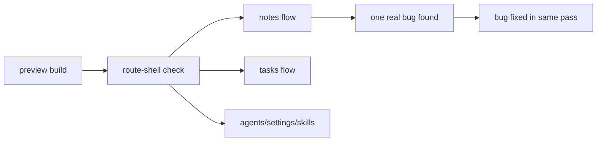

# UMBRA preview qa - 2026-03-20

## scope

qa lief gegen den gebauten preview-stand unter browser-mode:

1. route-shell
2. notes create/edit/autosave
3. tasks empty-state und create-modal
4. agents route
5. settings route
6. skills route

wichtig:

1. das war **preview/browser-mode**
2. tauri-ipc lief ueber `tauri-mock`
3. bewertet wurden rendering, navigation und client-regressionen
4. native tauri-runtime, window-controls und echte pm/uap-live-daten waren **nicht** teil dieses passes

## result

health-score: `8.5/10`

## findings

### fixed during qa

1. `notes -> + new` ist im browser-preview gecrasht mit `TypeError: crypto.randomUUID is not a function`
2. fix:
   `useNotesStore` nutzt jetzt einen fallback-id-generator
3. zusatzfix:
   `tauri-mock.save_note` liefert jetzt ein echtes note-shape zurueck, damit autosave im preview nicht gegen `null` laeuft

### remaining minor issues

1. `favicon.ico` liefert im preview `404`
2. beim task-modal kommt einmalig ein browser-info-log zu autofocus

keins von beiden blockiert die app-funktion.

## verified flows

1. dashboard route rendert stabil
2. notes route rendert, `+ new` funktioniert, titel/body-edit funktioniert, autosave-label erscheint
3. tasks route rendert vier lanes sauber, empty-state ist stabil, create-modal oeffnet
4. agents route rendert inklusive uap-banner
5. settings route rendert inklusive neuer uap-felder
6. skills route rendert ohne client-fehler

## console summary

1. keine neuen crash-errors nach dem notes-fix
2. nur `favicon.ico 404`
3. ein unkritischer autofocus-info-log beim task-modal

## recommendation

1. `favicon.ico` nachziehen, einfach damit die console komplett sauber ist
2. einen separaten tauri-native qa-pass auf windows 11 machen fuer:
   - mica
   - titlebar buttons
   - uap live-events
   - pm drag-kanban mit echten daten
