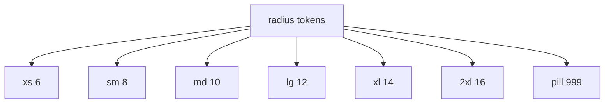

# radius pass

datum: 2026-03-20

## ziel

die app war an mehreren stellen zu rund. ziel war eine engere, ruhigere radius-sprache, orientiert an der agents-view.

## umgesetzt

1. globale radius-tokens in [base.css](C:\Users\matth\OneDrive\Dokumente\GitHub\UMBRA\src\assets\styles\base.css)
2. zentrale card-basis in [GlassCard.vue](C:\Users\matth\OneDrive\Dokumente\GitHub\UMBRA\src\components\ui\GlassCard.vue) enger gezogen
3. shell-radien reduziert in:
   1. [AppLayout.vue](C:\Users\matth\OneDrive\Dokumente\GitHub\UMBRA\src\components\layout\AppLayout.vue)
   2. [CustomTitlebar.vue](C:\Users\matth\OneDrive\Dokumente\GitHub\UMBRA\src\components\layout\CustomTitlebar.vue)
   3. [AppSidebar.vue](C:\Users\matth\OneDrive\Dokumente\GitHub\UMBRA\src\components\layout\AppSidebar.vue)
4. grosse content-surfaces enger gezogen in:
   1. [AgentsView.vue](C:\Users\matth\OneDrive\Dokumente\GitHub\UMBRA\src\views\AgentsView.vue)
   2. [DashboardView.vue](C:\Users\matth\OneDrive\Dokumente\GitHub\UMBRA\src\views\DashboardView.vue)
   3. [NotesView.vue](C:\Users\matth\OneDrive\Dokumente\GitHub\UMBRA\src\views\NotesView.vue)
   4. [NoteEditor.vue](C:\Users\matth\OneDrive\Dokumente\GitHub\UMBRA\src\components\notes\NoteEditor.vue)
   5. [TasksView.vue](C:\Users\matth\OneDrive\Dokumente\GitHub\UMBRA\src\views\TasksView.vue)
   6. [SettingsView.vue](C:\Users\matth\OneDrive\Dokumente\GitHub\UMBRA\src\views\SettingsView.vue)

## radius-logik

## befund

1. agents bleibt die referenz
2. dashboard und notes fuehlen sich dadurch weniger weich und weniger verspielt an
3. die pill-elemente bleiben pill-elemente, damit status und filter nicht ihre lesbarkeit verlieren

## qa

1. agents-screen in lokaler preview gecheckt
2. screenshot: `../tmp/playwright-output/page-2026-03-20T16-06-45-894Z.png`

## verifikation

1. `npm test` gruen (`15/15`)
2. `npm run build` gruen
