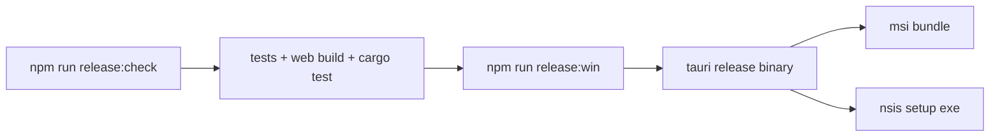

# release installer pass

## antwort auf die frage

ja. UMBRA baut jetzt echte windows-installer.

## artifacts

1. [UMBRA_0.1.0_x64_en-US.msi](C:\Users\matth\OneDrive\Dokumente\GitHub\UMBRA\src-tauri\target\release\bundle\msi\UMBRA_0.1.0_x64_en-US.msi)
2. [UMBRA_0.1.0_x64-setup.exe](C:\Users\matth\OneDrive\Dokumente\GitHub\UMBRA\src-tauri\target\release\bundle\nsis\UMBRA_0.1.0_x64-setup.exe)

## build-flow

## smoke

1. `npm run tauri build` lief erfolgreich durch.
2. release-exe wurde direkt gestartet: [umbra.exe](C:\Users\matth\OneDrive\Dokumente\GitHub\UMBRA\src-tauri\target\release\umbra.exe)
3. prozess blieb stabil laufen und wurde danach kontrolliert beendet.

## artefaktgrößen

1. `msi`: `3,928,064` bytes
2. `nsis exe`: `2,692,720` bytes

## urteil

der installer-existenzcheck ist bestanden. das ist kein „wir könnten theoretisch bundlen“, sondern ein real gebautes windows-paket.
