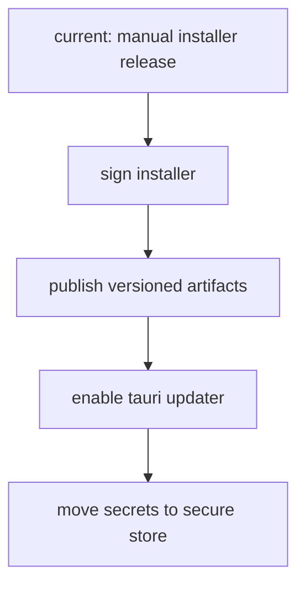

# release ops checklist

## status

1. installer-build: vorhanden
2. desktop smoke: vorhanden
3. config/defaults: gehärtet
4. autoupdate: noch nicht aktiviert
5. secrets-storage: funktional, aber noch user-config-basiert

## release-checklist

1. `npm run release:check`
2. `npm run release:win`
3. installer auf sauberem win11-system testen
4. in `Settings` echte `api url`, `dashboard url`, `repo root` setzen
5. optional `github pat` nur auf nutzersystemen hinterlegen, nicht im repo
6. taskbar-icon nach installation einmal frisch prüfen
7. launcher-local-actions gegen reale repo-pfade prüfen
8. uap-agenten mit neu generiertem token gegen echten host testen

## secrets

1. `githubPat` und `uapToken` werden aktuell lokal in der app-config gespeichert.
2. das ist für single-user desktop okay, aber nicht high-security.
3. wenn du härter gehen willst, ist der nächste schritt windows credential manager oder tauri-stronghold statt plain config.

## autoupdate

1. autoupdate ist aktuell bewusst nicht aktiv.
2. das ist besser als halb aktiv und falsch signiert.
3. für echten rollout fehlt noch:
   1. signer-setup
   2. update-endpoint/feed
   3. versioniertes release-publishing
   4. rollback-strategie

## empfehlter nächster ausbau

## urteil

für deine aktuelle lokale/win11-distribution ist UMBRA jetzt release-tauglich. für breitere verteilung fehlt nicht der installer, sondern vor allem signierung, updater und härteres secret-handling.
