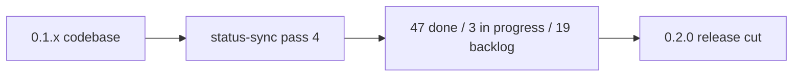
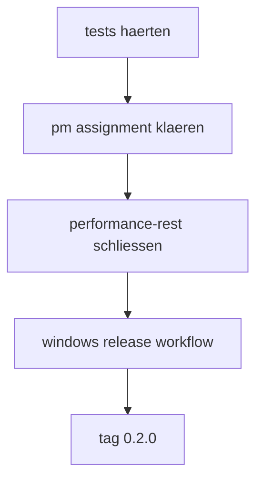

# UMBRA 0.2.0 release plan - 2026-03-20

## ziel

`0.2.0` soll kein feature-friedhof werden. der sinnvolle schnitt ist:

1. die gerade geschlossenen review-themen stabilisieren
2. die verbleibenden echten blocker fuer alltagstauglichkeit abraeumen
3. keine neuen grossbaustellen in den scope ziehen

## statusbasis

stand nach status-sync pass 4:

1. backlog: `19`
2. in progress: `3`
3. review: `0`
4. done: `47`

## release-definition

`0.2.0` ist fertig, wenn diese punkte gemeinsam stehen:

1. task-board zeigt keine fake-offenen review-restanten mehr
2. drag-kanban ist stabil nutzbar fuer projektgefilterte pm-flows
3. notes-flow fuehlt sich wie ein echtes arbeitswerkzeug an
4. skills-view ist fuer discovery brauchbar, nicht nur eine liste
5. test-layer deckt mindestens die kritischen ui- und rust-pfade ab
6. release/build-strang ist fuer windows sauber beschrieben oder automatisiert

## scope

### must ship

1. `[Testing] Rust command tests: expand coverage`
2. `UMBRA - A: Performance Pass remainder`
3. `UMBRA - B2: PM Tool assignment only (drag kanban done)`

### should ship

1. release build pipeline fuer windows artefakte
2. updater-konzept zumindest als technischer decision record
3. konsistente loading/error states auf task-, skills- und notes-pfaden

### not in 0.2.0

1. system tray
2. tm-lite bidirektional
3. plugin-system phase 3
4. onboarding
5. globale shortcuts

## konkrete arbeitspakete

### wp1 - test-haertung

ziel:
komponenten-tests fuer `TasksView`, `SkillsView`, `AgentsView` und mindestens einen notes-flow.

done, wenn:

1. drag-disabled state ohne projektfilter getestet ist
2. notes autosave und tags-flow getestet sind
3. global error bridge mindestens einmal getestet ist
4. rust-tests frontmatter parsing plus pm-integration helper absichern

### wp2 - pm-rest klaeren

ziel:
die offene b2-task ehrlich abschliessen oder explizit als api-gap isolieren.

schritte:

1. pm-api noch einmal gegen echte assign-faehigkeit pruefen
2. wenn assign nicht existiert:
   b2 in einen api-gap-task umformulieren
3. wenn assign existiert:
   backend command + ui selector + tests bauen

### wp3 - performance-rest schliessen

ziel:
den letzten performance-task nicht offen lassen, weil sein text unklar ist.

schritte:

1. views auf `content-visibility` bzw. bewussten verzicht pruefen
2. messen statt raten
3. task-text und code wieder in deckung bringen

### wp4 - release-schiene

ziel:
ein wiederholbarer windows-release-schnitt.

schritte:

1. build command fuer `.exe` und `.msi` festzurren
2. signing-entscheidung dokumentieren
3. changelog + versioning-konvention definieren
4. github actions workflow vorbereiten oder final bauen

## empfohlene reihenfolge

1. tests
2. pm assignment klaeren
3. performance-rest schliessen
4. release workflow bauen

## risiken

1. pm assignment kann weiterhin ein reiner backend-gap bleiben
2. mica ist jetzt im code, aber windows-spezifisches runtime-verhalten sollte einmal nativ qa-getestet werden
3. notes-frontmatter ist jetzt strukturierter, braucht aber echte vault-dogfooding-runden

## entscheidung

meine klare empfehlung:

1. `0.2.0` schlank halten
2. keine neue feature-kategorie mehr oeffnen
3. die letzten `3` in-progress-tasks hart abschliessen

