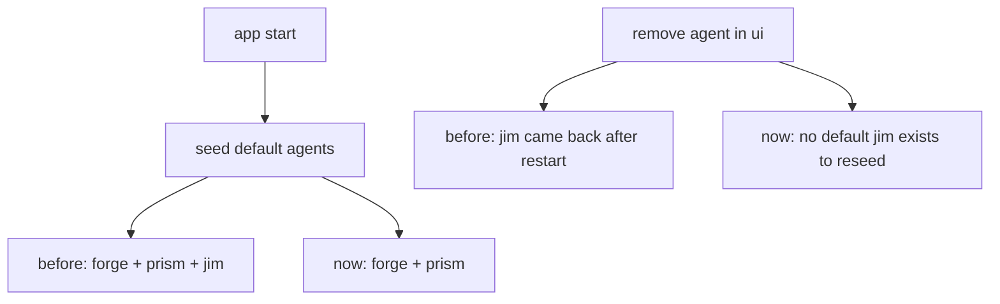

# Remove Jim Default Agent Pass

date: 2026-03-24
repo: `C:\Users\matth\OneDrive\Dokumente\GitHub\UMBRA`

## Summary

`jim` was a built-in seeded agent, not a normal custom agent. deleting him in the ui only removed the live registry entry for the current session, then startup seeding brought him back.

this pass removes `jim` from the built-in roster entirely.

## Changes

1. removed `jim` from the default agent seed list in rust
2. removed `jim` from built-in ordering and reserved-id handling
3. cleaned the agent-card initials map
4. updated the skills filter test data so it no longer expects `jim`

## Why

the old behavior was bad product logic. a built-in agent looked deletable, but the delete was not persistent because startup always re-seeded it.

if an agent should be removable, it cannot also be silently hard-coded as a mandatory default.

## Verification

1. `cargo test --manifest-path src-tauri/Cargo.toml`
2. `npx vitest run src/views/__tests__/SkillsView.test.ts`
3. `npm run build`
