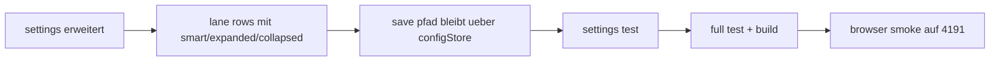

# settings lane prefs pass - 2026-03-22

## scope

dieser mini-pass macht die bisher versteckten lane-preferences endlich explizit sichtbar:

1. taskboard-lane-defaults in settings anzeigen
2. `smart`, `expanded`, `collapsed` pro lane steuerbar machen
3. save-pfad dafuer testseitig absichern

## umgesetzt

### 1. neue taskboard-section in settings

- [SettingsView.vue](C:\Users\matth\OneDrive\Dokumente\GitHub\UMBRA\src\views\SettingsView.vue)
- neue section `taskboard`
- fuer jede lane gibt es jetzt drei klare modi:
  1. `smart`
  2. `expanded`
  3. `collapsed`

abgedeckte lanes:

1. backlog
2. in progress
3. review
4. done

### 2. semantics

`smart` bedeutet:

1. backlog folgt weiter der dichte-logik
2. review und done folgen weiter dem intelligenten default
3. nur wenn du explizit `expanded` oder `collapsed` waehlst, wird der default ueberschrieben

### 3. test

- [SettingsView.test.ts](C:\Users\matth\OneDrive\Dokumente\GitHub\UMBRA\src\views\__tests__\SettingsView.test.ts)
- prueft:
  1. settings rendert `lane defaults`
  2. ein lane-mode laesst sich klicken
  3. `saveConfig` bekommt den aktualisierten `taskLanePrefs`-payload

## verifikation

1. gezielter vitest fuer settings + tasks gruen
2. `npm test` gruen, `18/18`
3. `npm run build` gruen
4. browser-smoke auf frischer preview `http://host.docker.internal:4191`

## browser smoke

live bestaetigt:

1. neue `taskboard`-section ist sichtbar
2. backlog, in progress, review und done zeigen die drei mode-buttons
3. copy erklaert klar, was `smart` macht

## flow

## kritik

1. das ist jetzt klarer als das bisherige versteckte verhalten
2. die naechste stufe waere ein kleiner preview-hinweis in settings, wie `smart` pro lane gerade konkret interpretiert wird
