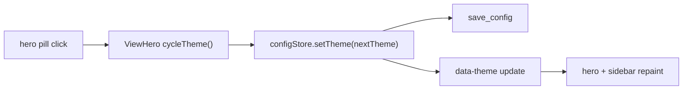

# shared hero + theme cycle pass

## ziel

1. dieselbe ruhige hero-bühne für die hauptviews
2. ein theme-toggle direkt im hero statt nur passiver text
3. die sidebar-brand-card auf dieselbe höhe und denselben visuellen takt ziehen

## umgesetzt

1. `src/components/layout/ViewHero.vue` als gemeinsame hero-komponente
2. theme-pill toggelt zyklisch `ember -> neon -> light -> ember`
3. hero-pass für `dashboard`, `agents`, `tasks`, `cron`, `notes`, `launcher`, `plugins`, `skills`, `settings`
4. brand-card in der sidebar auf `--view-hero-*` tokens umgestellt

## flow

## kritik

1. das dashboard als css-sonderling war vorher nett, aber architektonisch faul
2. jetzt ist die bühne konsistent genug, dass spätere view-varianten bewusst und nicht versehentlich passieren
