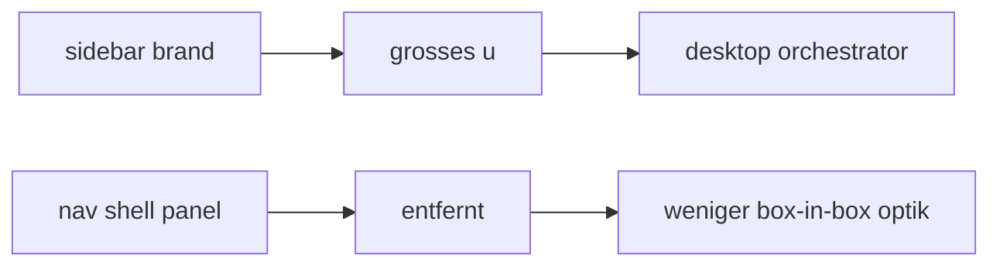

# sidebar brand + nav shell pass

## ziel

1. brand-copy unter dem grossen `u` auf `desktop orchestrator` umstellen
2. die extra box um den nav-stack entfernen

## umgesetzt

1. `brand-copy` zeigt jetzt nur noch `desktop orchestrator`
2. `UMBRA / control panel` unter dem emblem entfernt
3. `nav-shell` hat keine eigene panel-umrandung mehr und liegt direkt in der sidebar

## flow

## betroffene datei

1. `src/components/layout/AppSidebar.vue`

## kritik

1. die extra nav-box war redundant
2. so wirkt die sidebar klarer und weniger verschachtelt
