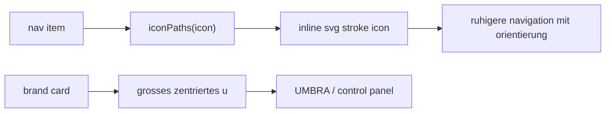

# sidebar icon + brand pass

## ziel

1. labels etwas ruhiger ziehen
2. echte icons vor die menüpunkte setzen
3. die obere brand-card auf ein zentriertes großes `u` umstellen

## umgesetzt

1. neue inline-svg-icons fuer `dashboard`, `agents`, `tasks`, `cron`, `notes`, `launcher`, `plugins`, `skills`, `settings`
2. labels etwas kleiner und ruhiger als im letzten pass
3. brand-card jetzt mit großem zentriertem `u`
4. brand-copy auf `UMBRA` + `control panel`

## flow

## betroffene datei

1. `src/components/layout/AppSidebar.vue`

## kritik

1. das ist die richtige richtung
2. ganz ohne icons war die sidebar zu nackt, mit den alten code-pills aber zu technisch
3. jetzt liegt sie eher in der mitte und wirkt deutlich erwachsener
