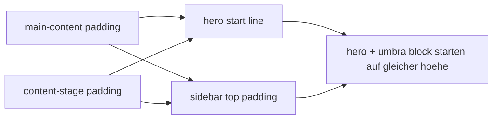

# sidebar pill + alignment pass

## ziel

1. nav-pills entschlacken
2. nur noch `dashboard`, `agents`, `tasks`, ... als labels zeigen
3. den oberen `umbra`-block vertikal auf den hero-start der hauptfläche ziehen

## umgesetzt

1. hints aus der sidebar-navigation entfernt
2. nav-pills auf single-line-labels reduziert
3. stage-padding tokenisiert über `--stage-edge-pad` und `--stage-inner-pad`
4. sidebar-top-padding an dieselbe stage-logik gebunden

## layout-logik

## betroffene dateien

1. `src/components/layout/AppSidebar.vue`
2. `src/components/layout/AppLayout.vue`
3. `src/assets/styles/base.css`

## kritik

1. die hint-zeilen in der sidebar haben nur laerm gemacht
2. der alignment-fix gehoert auf tokens, nicht auf irgendwelche einmaligen margin-hacks
