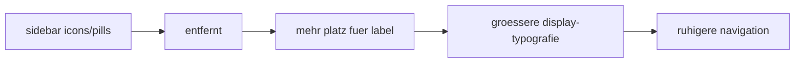

# sidebar pill removal pass

## ziel

1. die kleinen code-pills `u`, `db`, `ag`, `tk`, ... entfernen
2. die navigation über typografie statt badges führen

## umgesetzt

1. brand-mark im `umbra`-block entfernt
2. nav-code-pills komplett entfernt
3. menülabels größer auf `font-display` gezogen
4. labels jetzt `Dashboard`, `Agents`, `Tasks`, ... statt badge + kleine copy

## flow

## betroffene datei

1. `src/components/layout/AppSidebar.vue`

## kritik

1. die code-pills waren an dem punkt nur noch ui-rauschen
2. die navigation liest sich jetzt eher wie eine app und weniger wie ein debug-panel
