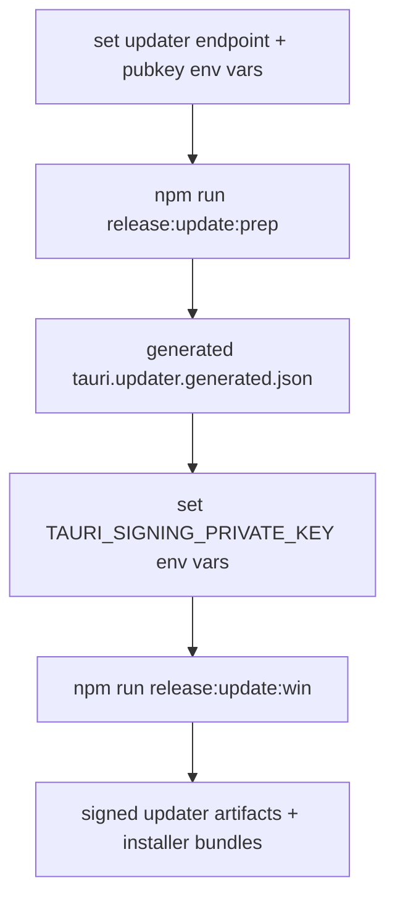

# signing + updater pass

## ziel

UMBRA sollte nicht nur manuell bundlen koennen, sondern einen echten v2-updater-pfad vorbereitet haben, ohne dafuer harte release-secrets ins repo zu kippen.

## gebaut

1. runtime-updater-kommandos in [updates.rs](C:\Users\matth\OneDrive\Dokumente\GitHub\UMBRA\src-tauri\src\commands\updates.rs)
2. updater-plugin-init in [lib.rs](C:\Users\matth\OneDrive\Dokumente\GitHub\UMBRA\src-tauri\src\lib.rs)
3. updater-settings in [SettingsView.vue](C:\Users\matth\OneDrive\Dokumente\GitHub\UMBRA\src\views\SettingsView.vue)
4. neue release-skripte in [package.json](C:\Users\matth\OneDrive\Dokumente\GitHub\UMBRA\package.json)
5. generated updater config via [build-updater-config.mjs](C:\Users\matth\OneDrive\Dokumente\GitHub\UMBRA\scripts\build-updater-config.mjs)

## release-flow

## wichtige punkte

1. updater-konfiguration lebt jetzt bewusst runtime-seitig in settings und build-seitig im generated config-file.
2. signing-secrets bleiben in env vars, nicht im repo.
3. ohne echten release-feed und private signing-key ist der updater absichtlich nicht „magisch an“, sondern nur vorbereitet.

## verifikation

1. `cargo test` grün, `22/22`
2. `npm test` grün, `19/19`
3. `npm run build` grün
4. `npm run release:update:prep` mit dummy-werten grün

## quellen

1. [Tauri Updater](https://v2.tauri.app/plugin/updater/)
2. [Tauri Windows Code Signing](https://v2.tauri.app/distribute/sign/windows/)
