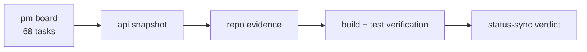
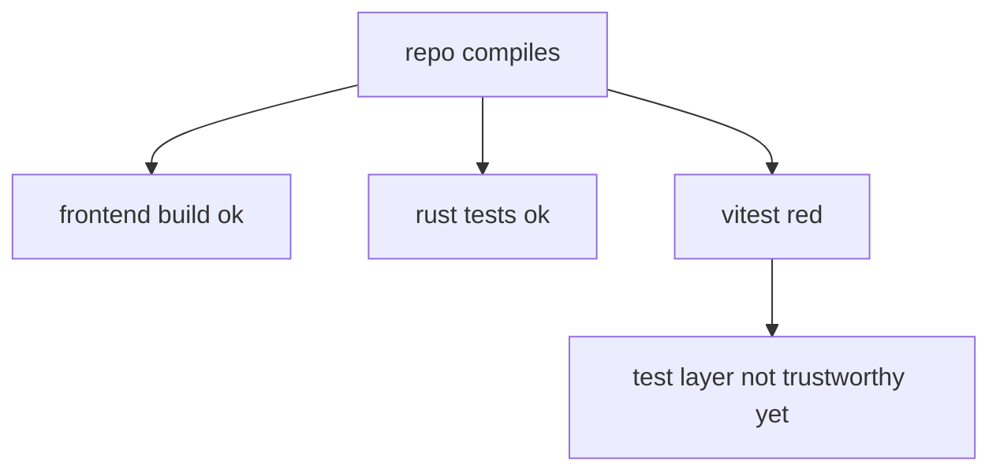
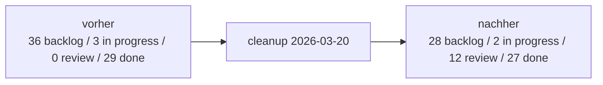
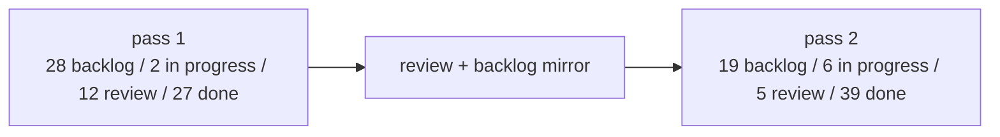
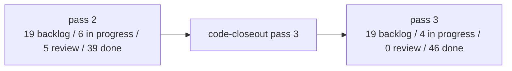
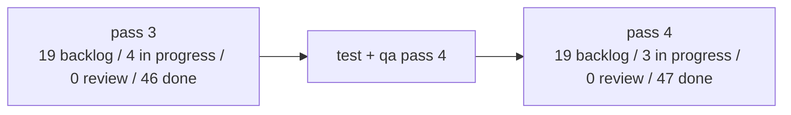

# UMBRA status sync - 2026-03-20

## scope

dieser abgleich vergleicht:

1. den aktuellen PM-board-stand fuer projekt `UMBRA`
2. den lokalen repo-stand in `C:\Users\matth\OneDrive\Dokumente\GitHub\UMBRA`
3. echte verifikation per build/tests

es wurden **keine tasks verschoben**. das hier ist nur der belastbare statusabgleich.

## quellen

1. PM API: `http://100.115.61.30:8000/api/projects/1566ae21-b08b-4641-86f4-c16e7064d5a7/tasks`
2. PM UI: `http://100.115.61.30:4173/projects/1566ae21-b08b-4641-86f4-c16e7064d5a7`
3. lokaler code: `src/`, `src-tauri/`
4. verifikation:
   - `npm run build`
   - `npm test`
   - `cargo test`

## board snapshot

- backlog: 36
- in progress: 3
- review: 0
- done: 29
- gesamt: 68
- offen gesamt: 39

## verifizierter code-status

### build and tests

1. `npm run build`: **gruen**
2. `cargo test`: **gruen** (9 tests)
3. `npm test`: **rot**
   grund: vitest/mock-alias konflikt rund um `@tauri-apps/api/*`

### harte repo-signale

1. PM tool bidirektional ist bereits im code:
   - `src/views/TasksView.vue`
   - `src/stores/useTaskStore.ts`
   - `src-tauri/src/commands/integrations.rs`
2. UAP server ist bereits im code:
   - `src-tauri/src/uap.rs`
   - `src-tauri/src/lib.rs`
   - `src/stores/useAgentStore.ts`
   - `src/views/AgentsView.vue`
3. performance-pass ist groesstenteils drin:
   - `src/components/atmosphere/EmberCanvas.vue`
   - `src/components/ui/GlassCard.vue`
   - `src/composables/useCache.ts`
4. notes, launcher, settings, github, plugins, cron, routing sind real vorhanden:
   - `src/views/NotesView.vue`
   - `src/components/notes/NoteEditor.vue`
   - `src/views/LauncherView.vue`
   - `src/views/SettingsView.vue`
   - `src/views/PluginsView.vue`
   - `src-tauri/src/commands/github.rs`
   - `src-tauri/src/cron/mod.rs`

## groesste board-repo mismatches

### 1. task B ist weiter als das board behauptet

**board:** `in progress`  
**task:** `UMBRA - B: PM Tool bidirektional (create/move/assign/comment)`

**im repo nachweisbar:**

1. task erstellen
2. task verschieben
3. task editieren
4. kommentar an task haengen
5. projekt/column loading fuer PM UI

**fehlend gegenueber task-text:**

1. `assign_pm_task` existiert nicht
2. drag-and-drop kanban existiert nicht, nur move-buttons

**urteil:** nicht mehr "fruehes in progress", sondern **fast fertig / review-faehig nach split**

### 2. task A ist zu breit, aber nicht mehr roh

**board:** `in progress`  
**task:** `UMBRA - A: Performance Pass (backdrop-filter, canvas, cache)`

**im repo nachweisbar:**

1. `GlassCard` ohne `backdrop-filter`, mit `contain`
2. `EmberCanvas` auf `25` partikel reduziert
3. `useCache()` existiert und wird in `useAgentStore` genutzt

**nicht exakt erledigt wie task beschrieben:**

1. `content-visibility: auto` wurde nicht gefunden
2. statt dessen existiert nur globales `contain: layout style`

**urteil:** **ca. 75% erledigt**, task sollte aufgespalten oder enger neu formuliert werden

### 3. task C ist praktisch schon im code

**board:** `in progress`  
**task:** `UMBRA - C: UAP Agent Heartbeat Protocol (axum :8765)`

**im repo nachweisbar:**

1. axum server auf konfiguriertem port
2. `POST /api/agents/{id}/heartbeat`
3. `GET /api/agents/{id}/tasks`
4. agent registry + task queues
5. tauri event `agent-status-changed`
6. frontend listener und push-task UI

**restprobleme:**

1. UI zeigt noch harte endpoint/token werte
2. endpoint-hinweis im UI passt nicht sauber zum lokalen server-start
3. produktionsreife auth/config noch nicht sauber rausgezogen

**urteil:** **review**, nicht normales `in progress`

### 4. backlog enthaelt bereits implementierte basisarbeit

diese backlog-karten sind im code bereits klar sichtbar und sollten mindestens neu bewertet werden:

1. `[Core] Tauri Backend - IPC Commands Grundgeruest`
2. `[Core] PM Tool API Integration`
3. `[Core] GitHub API Integration`
4. `[Core] Lokale Config & Persistenz`
5. `[UI] Agent Overview Dashboard`
6. `[UI] Skills Browser - durchsuchbare Library`
7. `[UI] IDE Launcher Panel`
8. `[UI] PM Tool Dashboard Widget`
9. `[UI] Navigation & Layout Shell`

**urteil:** backlog ist hier deutlich veraltet.

### 5. done enthaelt zu optimistische "fertig"-karten

#### custom titlebar + mica

`UMBRA - Tauri 2: tauri.conf.json + Custom Titlebar (frameless, Win11 Mica)` steht auf done.

**realitaet:**

1. frameless + custom titlebar: ja
2. echter mica/acrylic code: nicht gefunden

**urteil:** eigentlich **teilfertig**, nicht voll done.

#### agent overview mit prism, forge, jim

`UMBRA - Frontend: Agent Overview View (Prism, Forge, Jim + Live-Status)` steht auf done.

**realitaet:**

1. default agents im rust-code: nur `forge`, `prism`
2. `jim` ist nicht in `default_agents()`

**urteil:** done-text passt nicht mehr zum code.

## was wirklich noch offen aussieht

diese themen wirken nach code-pruefung weiterhin real offen:

1. agent-assignment im PM tool
2. echtes kanban drag-and-drop
3. first-run onboarding
4. system tray integration
5. globale keyboard shortcuts
6. notification/toast system
7. autostart bei windows login
8. echter mica/acrylic effekt
9. updater/release pipeline
10. e2e test-suite
11. vollstaendige skill-filterung nach kategorie/agent
12. vollstaendige note-frontmatter/yaml-sync laut task-spec
13. loading skeletons / konsistente loading states

## test-health verdict

**konkreter blocker:**

1. `vite.config.ts` mapped ausserhalb von tauri sowohl `@tauri-apps/api/core` als auch `@tauri-apps/api/event` auf dieselbe mock-datei
2. `src/stores/__tests__/useAgentStore.test.ts` mockt die module zwar separat, aber der resolver/mocking-layer laeuft nicht sauber

das ist ein eigenes maintenance-ticket wert.

## empfehlter board-cleanup

1. `UMBRA - C: UAP Agent Heartbeat Protocol` nach **review** schieben
2. `UMBRA - B: PM Tool bidirektional` in zwei tasks splitten:
   - core crud/comment/move -> **done oder review**
   - assign + drag-and-drop -> **in progress**
3. `UMBRA - A: Performance Pass` auf restarbeit reduzieren:
   - fehlendes `content-visibility` oder bewusst verwerfen
4. die offensichtlichen basis-backlog-tasks in einem board-sweep neu labeln:
   - **done**, wenn nur basisziel gemeint war
   - **review**, wenn die feature-spec spaeter erweitert wurde
5. neue task anlegen: `fix vitest tauri mock aliasing`
6. done-lane auf wording pruefen:
   - "mica"
   - "jim"
   - andere ueberdehnte task-titel

## knapper architektur-befund

das projekt ist **deutlich weiter als das board**. das eigentliche problem ist im moment nicht fehlender code, sondern fehlende board-hygiene:

1. zu viele basis-features haengen noch in backlog
2. mehrere done-karten sind semantisch uebertrieben
3. review-lane wird faktisch nicht genutzt

wenn du so weitertrackst, wird das board bald unbrauchbar fuer echte priorisierung.

## cleanup applied

der folgende cleanup wurde nach dem report direkt umgesetzt:

1. vitest alias-fix in `vite.config.ts`
2. agent-store test auf cache-bypass stabilisiert
3. UAP task nach review geschoben
4. PM bidirektional in `B1 core` und `B2 restarbeit` getrennt
5. performance-task auf echten rest reduziert
6. 8 backlog-basis-tasks nach review geschoben
7. 2 zu optimistische done-tasks nach review zurueckgezogen

### post-cleanup board snapshot

- backlog: 28
- in progress: 2
- review: 12
- done: 27

## second pass applied

danach lief noch ein zweiter spiegel-pass:

1. `tauri-mock` build-warning entfernt
2. review-lane task-fuer-task bewertet
3. remaining backlog gegen echten code gespiegelt

### technical result

1. `npm run build`: gruen, ohne die vorherige `tauri-mock` warning
2. `npm test`: gruen, 8/8 tests

### board result after second pass

- backlog: 19
- in progress: 6
- review: 5
- done: 39

### review lane now means something

die review-lane enthaelt jetzt nur noch:

1. `NotesView: split-view editor review`
2. `Notes CRUD: vault sync review`
3. `AgentsView: UAP live-status review`
4. `Agent Overview View (Prism, Forge, Jim + Live-Status)`  
   problem: `jim` fehlt im default roster
5. `tauri.conf.json + Custom Titlebar (frameless, Win11 Mica)`  
   problem: titlebar da, echter mica-effekt nicht

### in-progress lane now also means something

1. `Performance Pass remainder`
2. `PM Tool assignment + drag kanban`
3. `SkillsView: finish filters after search`
4. `Error handling: finish global boundary flow`
5. `Rust command tests: expand coverage`
6. `Vue tests: move from store coverage to components`

## third pass applied

danach wurde noch ein dritter umsetzungs-pass gefahren, diesmal nicht nur board-hygiene, sondern echter code-closeout:

1. `jim` in den default-agent-roster aufgenommen
2. uap endpoint/token/port in die echte app-config gezogen
3. win11 mica in tauri via `window-vibrancy` aktiviert
4. notes auf yaml-frontmatter, tags und autosave gehoben
5. skills-view mit category/agent-filtern, full-content modal und keyboard-nav erweitert
6. global vue error bridge + unhandled rejection fallback angeschlossen
7. tasks-view auf 4 echte pm-lanes plus drag-and-drop/reorder umgestellt

### technical verification after pass 3

1. `cargo test`: gruen, `11/11`
2. `npm test`: gruen, `8/8`
3. `npm run build`: gruen

### board result after pass 3

- backlog: 19
- in progress: 4
- review: 0
- done: 46

### what is still honestly open

1. `Vue tests: move from store coverage to components`
2. `Rust command tests: expand coverage`
3. `Performance Pass remainder`
4. `PM Tool assignment only (drag kanban done)`

zu `B2` ist der stand jetzt eindeutig:

1. drag-kanban ist erledigt
2. echtes assignment bleibt offen
3. die sichtbare pm-openapi zeigt weiterhin kein assignee-feld und keinen assign-endpoint

das ist damit kein frontend-ausrede-task mehr, sondern ein echter api-gap.

## fourth pass applied

der vierte pass war test-haertung plus preview-qa:

1. neue vue-komponententests fuer `TasksView`, `SkillsView`, `NotesView`, `AppLayout`
2. neue rust-helper-tests fuer pm-task-enrichment
3. browser-preview-qa gegen den build-stand
4. notes-preview-bug (`crypto.randomUUID`) direkt im gleichen pass gefixt
5. preview-host fuer `host.docker.internal` in vite preview freigeschaltet

### technical verification after pass 4

1. `npm test`: gruen, `12/12`
2. `cargo test`: gruen, `13/13`
3. `npm run build`: gruen

### board result after pass 4

- backlog: 19
- in progress: 3
- review: 0
- done: 47

### what changed in the board

1. `Vue tests: move from store coverage to components` -> done
2. `Rust command tests: expand coverage` bleibt in progress
3. `PM Tool assignment only (drag kanban done)` bekam den backend-contract als naechsten echten schritt

### qa output

ein eigener qa-report liegt hier:

1. `docs/qa-preview-2026-03-20.md`

kurzfassung:

1. preview-route-shell stabil
2. notes create/edit/autosave stabil nach fix
3. tasks empty-state und modal stabil
4. uebrig blieb nur `favicon.ico 404`
