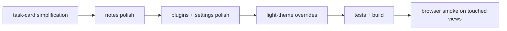

# task simplification + light theme pass - 2026-03-22

## scope

dieser pass hat drei dinge zusammengezogen:

1. task-cards im board vereinfachen
2. notes, plugins und settings auf dieselbe ruhigere shell ziehen
3. light theme und kontrast auf den betroffenen views kurz gegenpruefen

## umgesetzt

### 1. tasks

- [TasksView.vue](C:\Users\matth\OneDrive\Dokumente\GitHub\UMBRA\src\views\TasksView.vue)
- cards zeigen jetzt eine klarere topline statt alles auf einer lauten meta-zeile
- projektlabel wird nur noch gezeigt, wenn nicht bereits auf ein projekt gefiltert wird
- description wird als kurze summary eingeblendet statt als unruhiger freitext-block
- support-meta wie due date oder comments sitzt gesammelt und subtil in der topline
- action-row ist sauberer getrennt: lane-actions links, edit/comment rechts

### 2. notes

- [NotesView.vue](C:\Users\matth\OneDrive\Dokumente\GitHub\UMBRA\src\views\NotesView.vue)
- [NoteEditor.vue](C:\Users\matth\OneDrive\Dokumente\GitHub\UMBRA\src\components\notes\NoteEditor.vue)
- sidebar, editor-frame und empty-state haben jetzt ruhigere surfaces und engere radien
- note-list wurde etwas verdichtet
- editor-toolbar und pane-spacing sind sauberer auf die shell abgestimmt
- light theme fuer pane-surfaces, hover und active note wurde explizit nachgezogen

### 3. plugins + settings

- [PluginsView.vue](C:\Users\matth\OneDrive\Dokumente\GitHub\UMBRA\src\views\PluginsView.vue)
- [SettingsView.vue](C:\Users\matth\OneDrive\Dokumente\GitHub\UMBRA\src\views\SettingsView.vue)
- plugin cards, roadmap-items und broker-feature wurden optisch beruhigt
- settings spacing, page-title und swatches sind jetzt naeher an der agents/tasks-sprache
- light theme overrides fuer pills, roadmap surfaces und swatches verhindern dunkle restartefakte

## qa

### verifikation

1. `npm test` gruen, `15/15`
2. `npm run build` gruen

### browser smoke

lokale preview auf `http://127.0.0.1:4186` und browser-zugriff ueber `http://host.docker.internal:4186`.

geprueft:

1. `tasks`
2. `notes`
3. `plugins`
4. `settings`

ergebnis:

1. `data-theme="light"` war aktiv
2. tasks-lanes rendern mit heller flaeche und heller border
3. notes-sidebar und editor-frame ziehen die light-theme surfaces
4. settings-swatches und inputs ziehen die hellen backgrounds/borders
5. plugins-roadmap zieht helle surfaces; broker-card war im preview ohne live-daten nur eingeschraenkt sichtbar

## flow

## kritik

1. das board ist jetzt klar lesbarer, aber die echte naechste stufe waere progressive disclosure fuer task-actions
2. der plugin-tab profitiert stark vom spacing-pass, bleibt aber datengetrieben unruhiger als notes/settings
3. fuer einen harten kontrast-pass waere als naechstes ein systematischer wcag-check auf text/pill-zustaende sinnvoll
