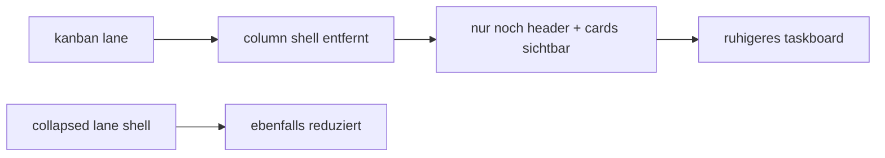

# tasks column shell removal pass

## ziel

1. die spaltenboxen im taskboard entfernen
2. lanes luftiger machen, ohne die task-cards selbst anzufassen

## umgesetzt

1. `col-body` hat keine eigene border, keinen background und keinen radius mehr
2. `lane-collapsed` ist ebenfalls von der box-optik befreit
3. drop-state bleibt als leichter background-hinweis erhalten

## flow

## betroffene datei

1. `src/views/TasksView.vue`

## kritik

1. die lane-shell war nach dem mainframe-pass nur noch der nächste unnötige rahmen
2. das board liest sich jetzt direkter und weniger verschachtelt
