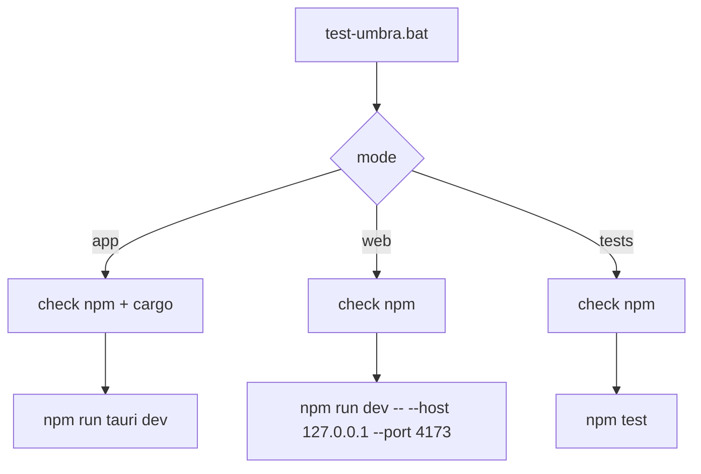

# test-umbra.bat

## ziel

eine feste windows-startdatei im repo-root, damit lokale app-tests nicht jedes mal von hand ueber `npm`-kommandos gestartet werden muessen.

## modi

1. `test-umbra.bat`
   startet `npm run tauri dev`
2. `test-umbra.bat web`
   startet nur den vite-dev-server auf `127.0.0.1:4173`
3. `test-umbra.bat tests`
   startet `npm test`
4. `test-umbra.bat help`
   zeigt die kurze hilfe

## ablauf

## checks

1. batch bricht sauber ab, wenn `npm` oder fuer app-mode `cargo` fehlt
2. batch bricht sauber ab, wenn `node_modules` noch nicht installiert ist
3. `RUST_BACKTRACE=1` ist gesetzt, damit tauri-crashes nicht komplett stumm bleiben
