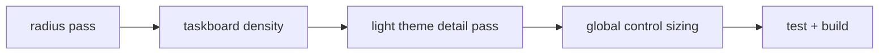

# ui polish pass - 2026-03-20

## ziel

der pass hat drei offene optik-themen zusammengezogen:

1. taskboard dichter und ruhiger machen
2. light theme im detail sauberer ziehen
3. button-, input- und textarea-groessen global angleichen

## umgesetzt

### 1. taskboard density pass

- header in [TasksView.vue](C:\Users\matth\OneDrive\Dokumente\GitHub\UMBRA\src\views\TasksView.vue) auf ruhigere hierarchy umgestellt
- lanes enger gesetzt: weniger gap, weniger padding, kleinere lane-titel
- task-cards verdichtet: titel, meta und action-row kompakter
- modal-header ebenfalls kleiner gezogen, damit der view nicht wieder gegen die neue shell arbeitet

### 2. light theme detail pass

- ambient-layer im light theme in [base.css](C:\Users\matth\OneDrive\Dokumente\GitHub\UMBRA\src\assets\styles\base.css) deutlich subtler
- light-theme cards in [glassmorphism.css](C:\Users\matth\OneDrive\Dokumente\GitHub\UMBRA\src\assets\styles\glassmorphism.css) mit hellerem surface und ruhigerem shadow
- light-theme buttons in [NeonButton.vue](C:\Users\matth\OneDrive\Dokumente\GitHub\UMBRA\src\components\ui\NeonButton.vue) weniger hart, vor allem secondary/ghost

### 3. globale control consistency

- button-sizes in [NeonButton.vue](C:\Users\matth\OneDrive\Dokumente\GitHub\UMBRA\src\components\ui\NeonButton.vue) auf feste min-heights gezogen
- inputs/selects/textareas in [glassmorphism.css](C:\Users\matth\OneDrive\Dokumente\GitHub\UMBRA\src\assets\styles\glassmorphism.css) auf einen gemeinsamen rhythmus gebracht
- globale font inheritance fuer controls in [base.css](C:\Users\matth\OneDrive\Dokumente\GitHub\UMBRA\src\assets\styles\base.css), damit browser-defaults nicht dazwischenfunken

## wirkung

1. das taskboard liest sich erwachsener und weniger "mobile modal ui"
2. light theme hat weniger milchglas-chaos und wirkt naeher an den agents-cards
3. buttons und form-controls haben jetzt ueber views hinweg denselben taktschlag

## verifikation

1. `npm test` gruen, `15/15`
2. `npm run build` gruen

## flow

## kritik

1. das ist der richtige richtungsschritt, aber noch kein kompletter taskboard-redesign
2. wenn die tasks-view weiter beruhigt werden soll, ist der naechste echte schritt weniger metadata pro card statt nur dichteres spacing
