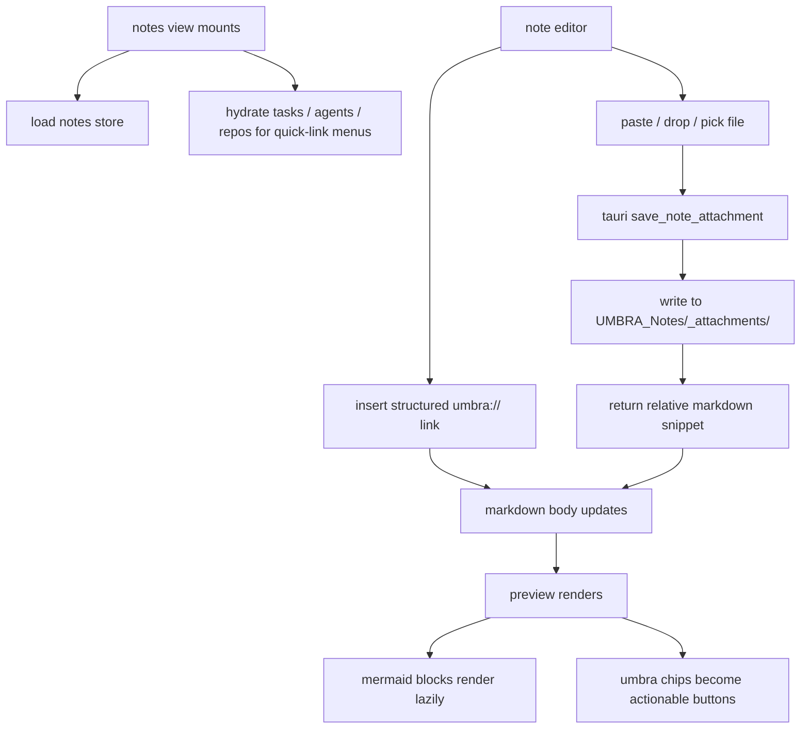

# UMBRA Priority Slice - 2026-03-24

## Scope

this pass started the implementation work for the improvement priorities `#6`, `#13`, `#14`, and `#15` from [umbra-improvement-priorities-2026-03-23.md](C:/Users/matth/OneDrive/Dokumente/GitHub/UMBRA/docs/umbra-improvement-priorities-2026-03-23.md).

`#5` has a PM task and implementation notes, but i deliberately did not jam tray work into the same patch. tray lifecycle touches app boot, window close behavior, and background state; that deserves its own narrow pass.

## Shipped In This Slice

1. command palette foundation with local search index across commands, notes, tasks, agents, skills, launchers, and repos
2. keyboard layer on top of that foundation with `ctrl+k`, `ctrl+shift+n`, and `alt+1..6`
3. notes quick-link insertion for tasks, agents, repos, and workspaces
4. preview-time quick-link chips that route or launch actions directly
5. note attachments via file picker, paste, and drag/drop
6. rust-side attachment persistence under the vault `_attachments` path

## Flow

## Verification

1. `npm test`
2. `npm run build`
3. `cargo test --manifest-path src-tauri/Cargo.toml`

## Next Slice

1. implement `#5` system tray behavior with show/hide, quit, and sync affordances
2. deepen `#14` chips from route jumps into entity-aware deep links
3. add attachment previews/list management so notes do not become markdown-only graveyards
