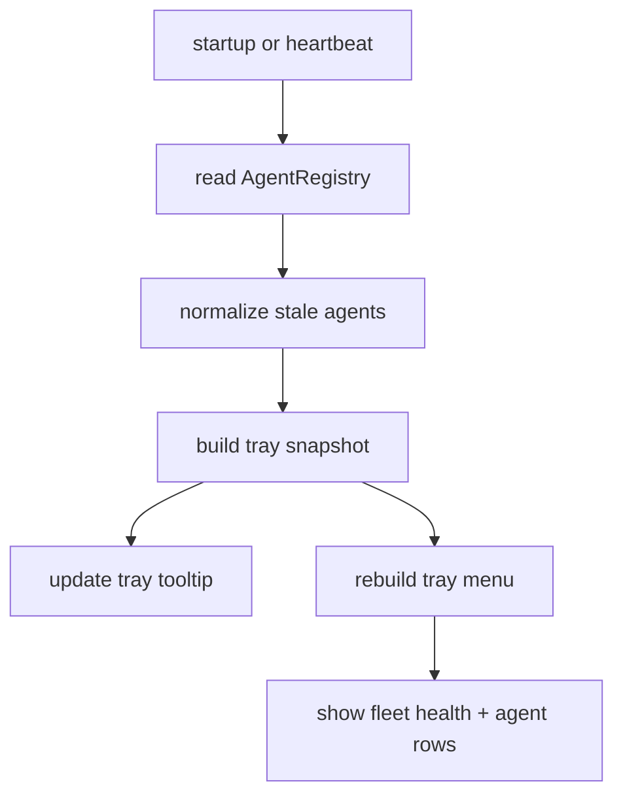
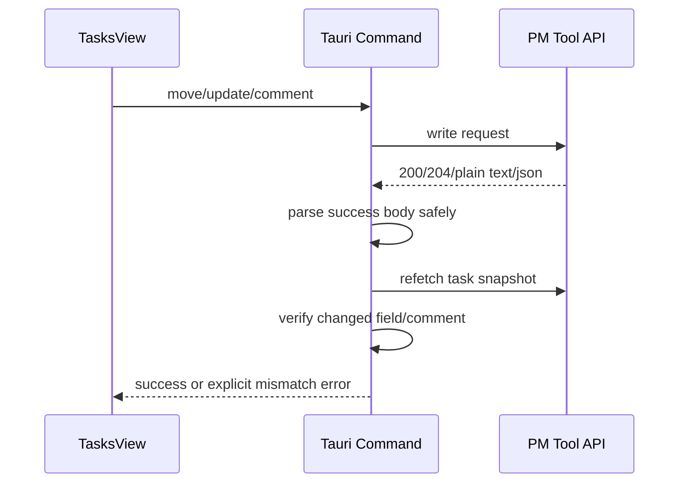

# UMBRA Tray Health + PM Hardening Pass

date: 2026-03-24
repo: `C:\Users\matth\OneDrive\Dokumente\GitHub\UMBRA`
scope: `7.1 + 7.3`

## Summary

this pass does two things:

1. the system tray now shows live agent-health as a dynamic summary plus per-agent rows, instead of being a static shell menu.
2. pm-tool write operations no longer assume that every success response contains valid json; move, update, and comment paths now parse empty bodies safely and verify the mutation by re-fetching task data.

## Why

the old tray integration was functional but operationally blind. it could hide/show the app, but it did not tell you whether the agent fleet was healthy.

the pm integration had the opposite problem: it looked confident while being too trusting. an empty `204` or a silent no-op backend write could still leave the ui believing a task move or comment succeeded.

## Implementation

### Tray Runtime

- added tray health snapshot generation from the live `AgentRegistry`
- normalized stale agents to `offline` for tray reporting
- rebuilt the tray menu dynamically with:
  - fleet health summary
  - aggregate counts
  - per-agent status rows
  - existing quick actions
- refreshed tray state:
  - on startup after registry seeding
  - on every agent heartbeat
  - every 60 seconds for stale/offline drift

### PM Write Hardening

- added a shared pm response parser that:
  - accepts `204` and empty success bodies
  - keeps plain-text success responses
  - errors clearly on invalid json-like payloads
- hardened `move_pm_task`, `update_pm_task`, and `add_pm_comment`
- each of those commands now re-fetches task data and verifies the intended mutation landed
- if the backend returns success but the task state still mismatches, umbra now surfaces that as an explicit error instead of pretending everything is fine
- `TasksView` now refreshes task data after posting a comment

## Verification

- `cargo test --manifest-path src-tauri/Cargo.toml`
- `npm test`
- `npm run build`
- targeted vitest pass for tray/task regressions

## Limitations

- windows/tauri tray menus do not support real per-row text colors in a clean native way. this pass uses status text plus tooltip summaries instead of faking color with brittle hacks.
- pm write verification currently re-fetches task data through project task lists. that is heavier than a dedicated `GET /api/tasks/{id}` endpoint would be, but it is honest and robust with the current backend surface.
