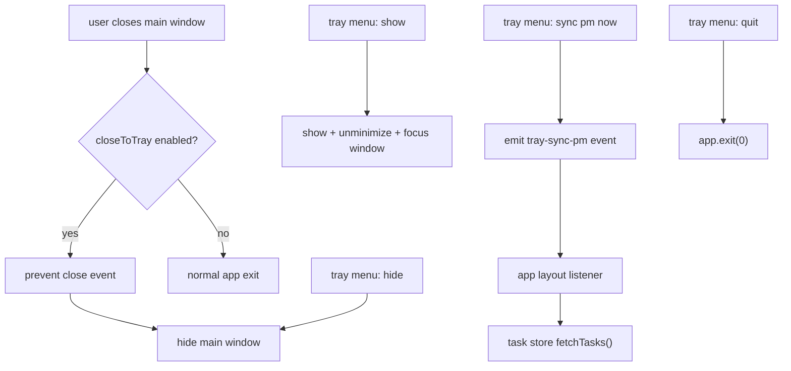

# UMBRA Tray Pass - 2026-03-24

## Scope

this pass implemented the first complete `#5` tray slice:

1. tray icon with `show`, `hide`, `sync pm now`, and `quit`
2. close-to-tray runtime behavior for the main window
3. settings toggle for `closeToTray`
4. frontend listener that reacts to the tray `sync pm now` action

## Runtime Flow

## Files

1. [lib.rs](C:/Users/matth/OneDrive/Dokumente/GitHub/UMBRA/src-tauri/src/lib.rs)
2. [config.rs](C:/Users/matth/OneDrive/Dokumente/GitHub/UMBRA/src-tauri/src/commands/config.rs)
3. [AppLayout.vue](C:/Users/matth/OneDrive/Dokumente/GitHub/UMBRA/src/components/layout/AppLayout.vue)
4. [SettingsView.vue](C:/Users/matth/OneDrive/Dokumente/GitHub/UMBRA/src/views/SettingsView.vue)

## Verification

1. `npx vitest run src/views/__tests__/SettingsView.test.ts src/components/layout/__tests__/AppLayout.test.ts`
2. `cargo test --manifest-path src-tauri/Cargo.toml config`
3. `cargo test --manifest-path src-tauri/Cargo.toml --lib`
4. `npm test`
5. `npm run build`

## Notes

1. i did not bolt on a second hidden worker model. hiding to tray keeps the existing tauri process, cron scheduler, and uap heartbeat alive, which is the sane version of "background mode" for this app.
2. i kept the tray menu intentionally boring. dynamic labels and tray-side config toggles sound clever, but they are where desktop apps start collecting weird platform bugs for no real gain.
